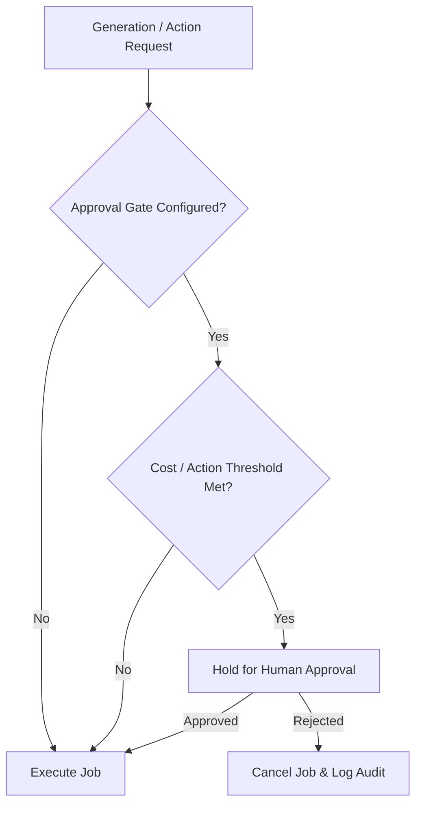

# Approval Policy & Cost Control

> **Canonical Document Location:** [`project-docs/10_GOVERNANCE/APPROVAL_POLICY.md`](project-docs/10_GOVERNANCE/APPROVAL_POLICY.md)

---

## 1. Governance Approval Policy

Human approval gates are embedded directly into system workflows to manage costs, prevent unauthorized overwrites, and ensure production quality.

---

## 2. Mandatory Human Approval Gates

| Gate Type | Trigger Condition | System Behavior | Override Authority |
| :--- | :--- | :--- | :--- |
| **High-Cost Generation Gate** | Single batch or project generation exceeding cost threshold (e.g., > \$5.00 or > 10 shot generations). | Job paused in `PENDING_APPROVAL` status. User notified via UI/Webhook. | Project Owner / User |
| **Cloud Final Render Gate** | Triggering high-resolution final master video encoding. | System renders watermark preview; full export holds for user confirmation. | Project Owner / User |
| **Locked Asset Overwrite Gate** | Attempt to regenerate or modify a `LOCKED` asset (Script, Scene, Shot, Reference, Voice). | Operation blocked by state machine; user prompt required to UNLOCK asset. | Project Owner / User |
| **External Integration Action Gate** | Webhook / API request requesting chargeable video generation from external agent. | Evaluates project quota and approval policy before submitting provider job. | Project Owner / System Quota Policy |

---

## 3. Cost Control & Usage Audit Rules

1. **Granular Cost Tracking:** Every AI generation job MUST record provider name, model identifier, prompt parameters, duration/count, retry count, shot ID, user ID, and calculated cost.
2. **Budget Safety Caps:** Projects contain configurable cost safety caps. Once a project budget cap is reached, further AI generation calls are halted until explicitly increased.
3. **Idempotency Safeguard:** External API integration requests MUST present an `idempotency_key` to prevent duplicate billing from network retries.
