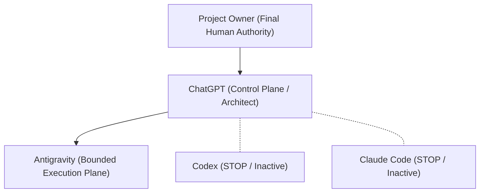

# Authority & Governance Model

> **Canonical Document Location:** [`project-docs/10_GOVERNANCE/AUTHORITY_MODEL.md`](project-docs/10_GOVERNANCE/AUTHORITY_MODEL.md)

---

## 1. Governance Roles & Hierarchy

Orbis Video Studio AI operates under a multi-tier authority model to prevent scope creep, unauthorized resource usage, and architectural degradation.

---

## 2. Role Specifications

### Project Owner
- **Authority Level:** Final Human Authority.
- **Responsibilities:**
  - Holds absolute approval and veto power over project vision, financial commitments, and release gates.
  - Authorizes new Work Packages (WPs).
  - Approves Pull Requests into `main`.
  - Authorizes cloud infrastructure deployments and API provider billing.

### ChatGPT
- **Authority Level:** Control Plane / Project Lead / System Architect / Independent Reviewer.
- **Responsibilities:**
  - Maintains project architectural integrity and domain consistency.
  - Performs independent review of Work Package deliverables.
  - Validates PR compliance against governance and locked requirements.
  - Formulates future Work Package specifications for execution engines.

### Antigravity
- **Authority Level:** Bounded Execution Plane (Low-Credit Execution Agent).
- **Responsibilities:**
  - Executes ONLY explicitly authorized Work Packages.
  - Conducts codebase research, drafts documentation, writes code (when authorized by active WP), and runs automated tests.
  - Strictly adheres to stop conditions and handoff protocols.
  - MUST NOT expand project scope or initiate new WPs without explicit Owner sign-off.

### Codex / Claude Code
- **Authority Level:** STOP / INACTIVE.
- **Status:** Strictly forbidden from executing operations unless re-authorized by Project Owner.

---

## 3. Decision & Escalation Matrix

| Decision Category | Required Authorization | Protocol |
| :--- | :--- | :--- |
| **Architectural Change** | ChatGPT Review + Owner Approval | Formal RFC in [`project-docs/10_GOVERNANCE/CHANGE_GOVERNANCE.md`](project-docs/10_GOVERNANCE/CHANGE_GOVERNANCE.md) |
| **Scope Expansion / New WP** | Project Owner Approval | Formal WP definition in [`project-docs/40_DELIVERY/WORK_PACKAGES.md`](project-docs/40_DELIVERY/WORK_PACKAGES.md) |
| **Financial / Provider Cost Gate** | Project Owner Approval | Configurable threshold in [`project-docs/10_GOVERNANCE/APPROVAL_POLICY.md`](project-docs/10_GOVERNANCE/APPROVAL_POLICY.md) |
| **PR Merge into `main`** | ChatGPT Review + Owner Merge | PR review checklist in [`project-docs/40_DELIVERY/RELEASE_GATES.md`](project-docs/40_DELIVERY/RELEASE_GATES.md) |
