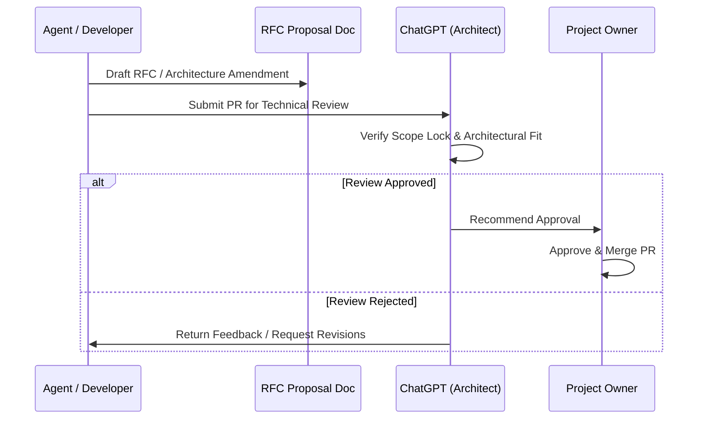

# Change Governance & RFC Protocol

> **Canonical Document Location:** [`project-docs/10_GOVERNANCE/CHANGE_GOVERNANCE.md`](project-docs/10_GOVERNANCE/CHANGE_GOVERNANCE.md)

---

## 1. Governance Overview

All changes to locked architecture, system domain models, V1 scope boundaries, or core governance policies must follow a controlled Request for Comments (RFC) and Pull Request (PR) workflow.

---

## 2. Document RFC Workflow

---

## 3. Commit & Pull Request Rules

- **Branch Naming Standard:** `ai/<work-package-id>-<short-description>` (e.g., `ai/p0-wp001-doc-foundation`).
- **Commit Message Standard:** Follow Conventional Commits format:
  - `docs: establish Orbis Video Studio AI governance foundation`
  - `feat(adapter): implement Vidu provider interface`
  - `fix(timeline): resolve shot sync alignment bug`
- **Pull Request Requirements:**
  - Must target `main`.
  - Must include explicit PR description with: files created/modified, locked decisions captured, open/TBD items, confirmation of scope compliance, exact git HEAD SHA.
  - MUST NOT be merged without ChatGPT review recommendation and Project Owner sign-off.
