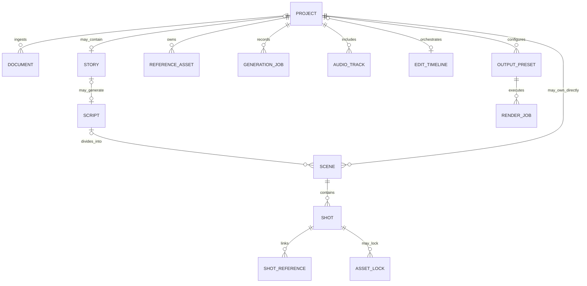

# Core Domain Model & Schemas

> **Canonical Document Location:** [`project-docs/20_ARCHITECTURE/DOMAIN_MODEL.md`](project-docs/20_ARCHITECTURE/DOMAIN_MODEL.md)

---

## 1. Domain Relationship Model



The Story/Script layer is optional at the domain level. `video_mode` determines whether it is required.

---

## 2. Project

Root container for any supported Orbis video production mode.

Suggested core fields:

- `id` (UUID)
- `title` (String)
- `description` (Text)
- `video_mode` (Enum/String): `STORY`, `SHORT`, `LOOP`, `SCENE`; extensible later
- `purpose` (String/Enum)
- `target_platform` (String/Enum)
- `target_duration_seconds` (Float, optional)
- `preferred_aspect_ratio` (String, optional)
- `mode_config` (JSON): provider-neutral mode-specific production configuration
- `default_config` (JSON): project-level inherited defaults
- `status` (Enum)
- timestamps

`video_mode` must not be encoded as a Vidu/provider setting.

---

## 3. Document

Uploaded factual/creative source files such as Brief, PDF, DOCX, PPTX, TXT and MD.

Key fields include project ownership, object-storage location and extracted text.

---

## 4. Story / Script

`Story` is an optional high-level narrative outline used by STORY mode and any later mode that explicitly requires narrative structure.

`Script` is an optional screenplay/script layer linked to Story or another explicitly supported creative structure.

Core services must not assume every Project owns a Story or Script.

---

## 5. Scene / Shot

`Scene` is a logical production scene and can exist under a Script or directly under a Project where the selected mode permits it.

`Shot` is the common execution unit across modes.

Suggested Shot source types:

```text
AI_GENERATED
IMPORTED_VIDEO
IMPORTED_IMAGE
RECORDED_FOOTAGE
STOCK_ASSET
MIXED
```

Typical Shot fields:
- shot number/order
- source type
- visual/video prompt
- duration
- camera motion
- provider-neutral generation request metadata
- linked Asset where media is actually ingested/stored
- status / lock state

Provider-specific request handling stays behind the provider adapter boundary.

---

## 6. Reference Assets

Project-level Reference Library supports Character, Location, Document, Prop, Brand, Style, Image, Existing Shot and Audio references.

No embeddings/vector DB/RAG dependency is required by the Core V1 architecture.

Reference priority remains:

```text
factual documents
> locked character/location
> project style/brand
> scene instruction
> shot instruction
> AI creativity
```

---

## 7. Asset Lock

Lock state protects approved production entities from accidental overwrite or regeneration.

Target entity types may include:

```text
SCRIPT
SCENE
SHOT
CHARACTER
LOCATION
VOICE
TIMING
```

Unlock must be explicit and auditable. Lock rules must remain compatible with later selective regeneration.

---

## 8. GenerationJob

WP007 established the provider-neutral durable generation-job model.

Key concerns include:
- provider name / provider job identity
- job status
- idempotency key
- retry/poll counters and scheduling
- durable claim/lease ownership
- submission attempt fencing
- reconciliation-required state for ambiguous chargeable operations
- safe allowlisted provider result metadata
- output URL metadata without fabricated Asset storage records

Core Shot/Scene logic must not directly call Vidu.

---

## 9. Audio / Timeline / Output

`AudioTrack`, `EditTimeline`, `OutputPreset` and `RenderJob` remain shared across modes where applicable.

Video Mode, Purpose, Target Platform and Output Preset are separate concepts. One master Project may render multiple platform/aspect variants.

---

## 10. Configuration Inheritance

```text
Project
  ↓
Scene
  ↓
Shot
```

Lower-level overrides are permitted only within validation and lock rules.
