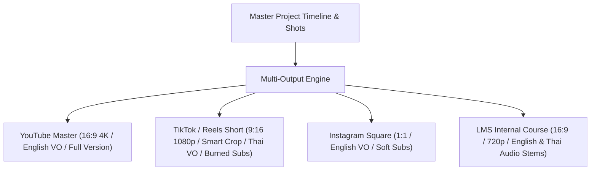

# Multi-Output & Multi-Platform Architecture

> **Canonical Document Location:** [`project-docs/20_ARCHITECTURE/MULTI_OUTPUT_ARCHITECTURE.md`](file:///c:/Users/allda/Desktop/Dev/git/Orbis%20Video%20Studio%20AI/project-docs/20_ARCHITECTURE/MULTI_OUTPUT_ARCHITECTURE.md)

---

## 1. One Master Project -> Many Outputs Model

Orbis Video Studio AI decouples master production assets from target output distribution profiles. A single **Master Project** containing base video shots, reference Bibles, dialogue stems, and timing tracks can export to dozens of output variants without re-generating base AI video shots.

---

## 2. Platform Presets & Parameter Matrix

| Preset ID | Target Platform | Aspect Ratio | Resolution | Framing Mode | Subtitle Mode | Bitrate Profile |
| :--- | :--- | :--- | :--- | :--- | :--- | :--- |
| `yt-16x9-master` | YouTube Main | `16:9` | 3840x2160 / 1080p | Native 16:9 | Optional Soft-Sub | High (25 Mbps) |
| `tt-9x16-reels` | TikTok / Instagram Reels | `9:16` | 1080x1920 | Smart Subject Focus Crop | Burned-in Animated | Medium (10 Mbps) |
| `ig-1x1-feed` | Instagram Feed | `1:1` | 1080x1080 | Pillarbox / Center Crop | Burned-in Standard | Medium (8 Mbps) |
| `lms-720p-low` | Internal LMS / Web | `16:9` | 1280x720 | Native 16:9 | Dual Language Soft | Web Standard (3 Mbps) |

---

## 3. Intelligent Re-framing & Rendering Rules

1. **Smart Subject Focus Cropping:** When rendering a 16:9 master video shot into a 9:16 vertical output preset, the render engine utilizes object tracking data (character bounding boxes) to dynamically pan/crop, ensuring key characters remain centered.
2. **Audio & Subtitle Swapping:** Multi-language VO audio tracks (e.g. Thai dub vs English VO) and subtitle files (SRT/VTT) are swapped dynamically at render time.
3. **No Unnecessary Re-generation:** Re-rendering an output target modifies ONLY encoding parameters, track selection, subtitle overlays, and cropping coordinates. Raw AI video clips generated from Vidu are cached and re-used across all output variants.
