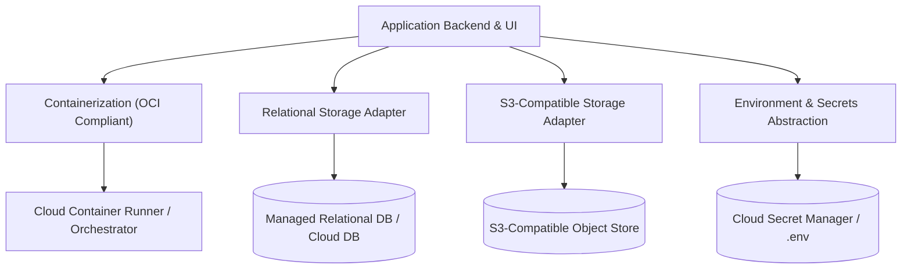

# Portability, Migration & Disaster Recovery

> **Canonical Document Location:** [`project-docs/20_ARCHITECTURE/PORTABILITY_AND_MIGRATION.md`](project-docs/20_ARCHITECTURE/PORTABILITY_AND_MIGRATION.md)

---

## 1. Cloud Portability Architecture

To ensure zero machine lock-in and seamless deployment across cloud infrastructure providers (AWS, GCP, Azure, DigitalOcean, or private cloud), the platform relies on containerization and standard interface abstractions.



---

## 2. Configuration & Technology Abstraction

- **Required Capability:** Zero hardcoded secrets, externalized environment variables, managed secret injection.
- **Recommended Candidates (TBD):** Docker / Podman container images; HashiCorp Vault / AWS Secrets Manager / GCP Secret Manager for secret injection.
- **Environment Parity:** Identical container images are used across Local Development, Staging, and Production environments.

---

## 3. Project Export / Import Package Schema

To prevent platform lock-in and facilitate backup, project migration, or offline archiving, projects can be exported as a portable `.orbis` package (ZIP format containing JSON manifest + media assets).

### Package Directory Structure
```
project_export_12345.orbis (ZIP Archive)
├── project.json              # Full project domain schema & locks
├── story_script.json         # Story, Script, Scene, Shot metadata
├── references/
│   ├── char_hero.png
│   └── location_lab.jpg
├── shots/
│   ├── shot_001_v1.mp4
│   └── shot_002_imported.mp4
├── audio/
│   ├── vo_en.wav
│   └── bgm_main.mp3
└── manifests/
    └── export_manifest.json  # Checksums, version, timestamp
```

---

## 4. Disaster Recovery & Backup Strategy

1. **Database Backups:** Daily automated relational database snapshot backups with point-in-time recovery (PITR) retention.
2. **Object Storage Replication:** Versioned object storage buckets to prevent data loss.
3. **Restoration Protocol:** Standardized automated recovery script re-populates relational database schema and re-attaches Object Storage assets within 15 minutes.
