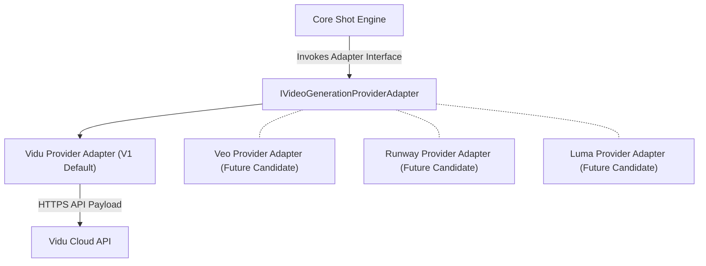

# Provider Adapter Architecture

> **Canonical Document Location:** [`project-docs/20_ARCHITECTURE/PROVIDER_ADAPTER_ARCHITECTURE.md`](project-docs/20_ARCHITECTURE/PROVIDER_ADAPTER_ARCHITECTURE.md)

---

## 1. Provider Isolation Principle

Orbis Video Studio AI enforces strict decoupling between the core domain engine and third-party AI video generation services. All AI video generation MUST execute through an abstract provider adapter interface.



---

## 2. Abstract Provider Adapter Interface Spec

All provider adapters MUST implement the generic interface contract (Language-agnostic abstraction pattern; TypeScript / Python as candidate implementations):

```typescript
export interface VideoGenerationParams {
  shotId: string;
  prompt: string;
  negativePrompt?: string;
  aspectRatio: '16:9' | '9:16' | '1:1';
  durationSeconds: number;
  seed?: number;
  referenceImages?: Array<{
    type: 'character' | 'location' | 'style' | 'first_frame' | 'last_frame';
    url: string;
    weight?: number;
  }>;
  cameraMotion?: {
    type: string;
    intensity: number;
  };
  providerSpecificParams?: Record<string, any>;
}

export interface ProviderJobResult {
  providerJobId: string;
  status: 'QUEUED' | 'PROCESSING' | 'COMPLETED' | 'FAILED';
  progressPercentage?: number;
  videoUrl?: string;
  thumbnailUrl?: string;
  costUsd?: number;
  errorMessage?: string;
  rawResponse?: Record<string, any>;
}

export interface IVideoGenerationProviderAdapter {
  readonly providerId: string; // e.g., 'vidu', 'veo', 'runway'
  
  submitGenerationJob(params: VideoGenerationParams): Promise<ProviderJobResult>;
  checkJobStatus(providerJobId: string): Promise<ProviderJobResult>;
  cancelJob(providerJobId: string): Promise<boolean>;
  validateConfig(config: Record<string, any>): boolean;
}
```

---

## 3. Vidu Adapter Specification (V1 Default)

### Primary Characteristics
- **Provider ID:** `vidu`
- **Default for V1:** YES (LOCKED requirement)
- **API Protocol:** Asynchronous HTTP REST API with Webhook notification & polling fallback.
- **Reference Image Payload:** Supports multi-image reference inputs (Character Bible reference images + Location reference image).

---

## 4. Multi-Provider Fallback & Extensibility

- **Future Candidate Providers (Veo, Runway, Luma):** Can be added by implementing `IVideoGenerationProviderAdapter` without altering the shot state machine, timeline engine, or database schemas.
- **No Tight Coupling:** Application backend code MUST NOT import provider-specific SDKs outside the adapter package directory.
