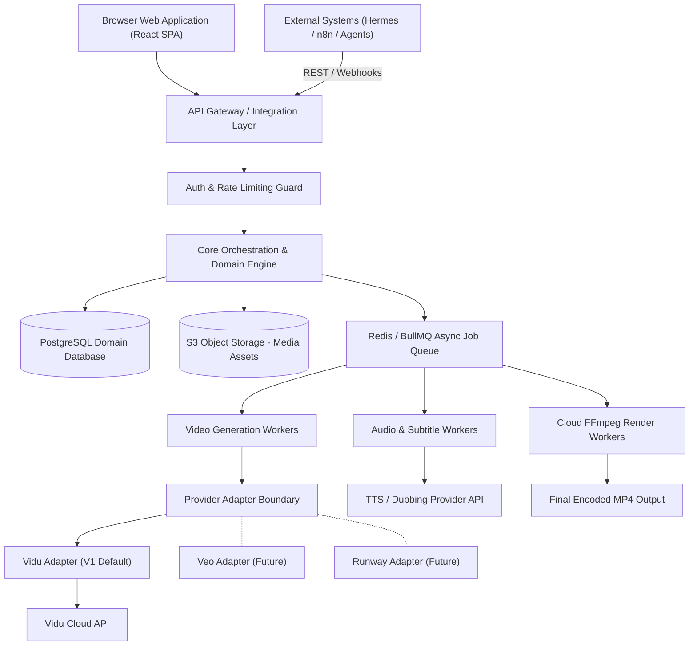

# Cloud System Architecture

> **Canonical Document Location:** [`project-docs/20_ARCHITECTURE/SYSTEM_ARCHITECTURE.md`](file:///c:/Users/allda/Desktop/Dev/git/Orbis%20Video%20Studio%20AI/project-docs/20_ARCHITECTURE/SYSTEM_ARCHITECTURE.md)

---

## 1. High-Level Architecture Overview

Orbis Video Studio AI is a cloud-first, provider-decoupled video production platform. Users interact through a browser UI, while back-end services orchestrate AI story generation, video synthesis via provider adapters (Vidu default), audio mixing, and multi-output rendering.

---

## 2. Component Layer Breakdown

### 1. Presentation Tier (Web UI)
- **Role:** Browser-based editing workspace accessible from any machine.
- **Key Features:** Document drag-and-drop, Story/Script editor, Scene/Shot grid, Reference Asset manager, Simplified Timeline preview, Multi-output preset exporter.
- **Dependency:** No local GPU or native software installation required.

### 2. API Gateway & Integration Gateway
- **Role:** Exposes internal API endpoints for the Web UI and secure integration boundaries for external platforms (Hermes, n8n).
- **Features:** Rate limiting, API key authentication, audit logging, idempotent request processing (`X-Idempotency-Key`).

### 3. Core Domain Orchestration Engine
- **Role:** Manages the lifecycle of Projects, Stories, Scripts, Scenes, Shots, and Assets.
- **Features:** Enforces Asset Locking state machine, manages configuration inheritance (Project -> Scene -> Shot), tracks generation budgets, orchestrates production pipeline.

### 4. Job Queue & Asynchronous Worker Pool
- **Role:** Handles long-running AI generation, audio synthesis, and cloud video rendering.
- **Features:** Distributed task dispatching, retry logic, provider rate-limit handling, job cancellation, status reporting.

### 5. Provider Adapter Framework
- **Role:** Decouples core logic from third-party video generation APIs.
- **Specification:** Detailed in [`project-docs/20_ARCHITECTURE/PROVIDER_ADAPTER_ARCHITECTURE.md`](file:///c:/Users/allda/Desktop/Dev/git/Orbis%20Video%20Studio%20AI/project-docs/20_ARCHITECTURE/PROVIDER_ADAPTER_ARCHITECTURE.md). Vidu is the primary default provider for V1.

### 6. Audio & Subtitle Engine
- **Role:** Handles Dialogue/Dubbing synthesis, Voice Over alignment, Background Music (BGM), Sound Effects (SFX), Subtitle SRT/VTT generation, and Auto-Ducking.

### 7. Cloud Render Service
- **Role:** Assembles master timeline tracks (video, audio, text, graphics) into final MP4 video outputs using cloud FFmpeg worker nodes.

### 8. Persistence & Storage Layer
- **Relational DB:** PostgreSQL storing metadata, domain entities, project states, and job cost audit logs.
- **Object Storage:** S3-compatible object storage (AWS S3, MinIO, Cloudflare R2) storing reference media, generated video clips, audio stems, and rendered final MP4 files.
