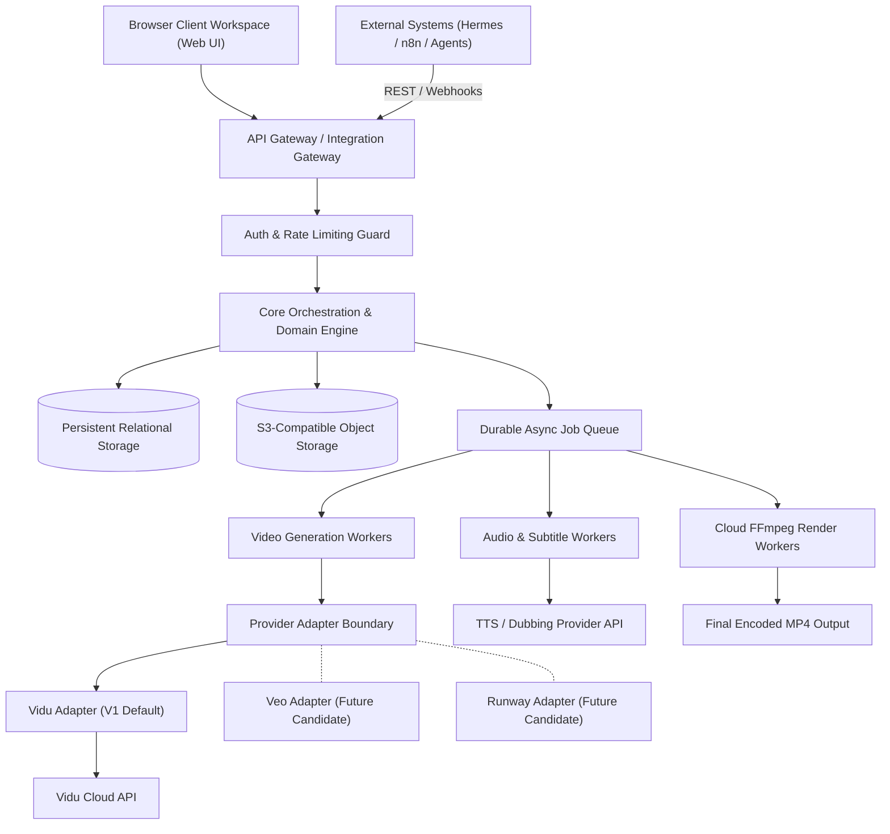

# Cloud System Architecture

> **Canonical Document Location:** [`project-docs/20_ARCHITECTURE/SYSTEM_ARCHITECTURE.md`](project-docs/20_ARCHITECTURE/SYSTEM_ARCHITECTURE.md)

---

## 1. High-Level Architecture Overview

Orbis Video Studio AI is a cloud-first, provider-decoupled video production platform. Users interact through a browser UI workspace, while backend services orchestrate AI story generation, video synthesis via provider adapters (Vidu default), audio mixing, and multi-output rendering.

---

## 2. Capability Requirements vs Technology Selection

To avoid premature technology lock-in prior to explicit Work Package authorization, system tiers distinguish **REQUIRED CAPABILITIES** from **RECOMMENDED CANDIDATES** and **TBD / UNLOCKED CHOICES**.

| Architecture Tier | Required Capability (LOCKED) | Recommended Candidates (TBD / UNLOCKED) |
| :--- | :--- | :--- |
| **Presentation Tier** | Cloud-first, browser-accessible workspace; zero local GPU dependency. | React SPA / Next.js / Vue.js *(Candidate TBD)* |
| **API Gateway Tier** | REST/Webhook gateway; authentication; rate limiting; idempotency. | Fastify / Express / NestJS / FastAPI *(Candidate TBD)* |
| **Domain Orchestration Tier** | Story, Script, Scene, Shot state machine; asset lock protection. | Node.js vs Python backend framework *(Candidate TBD)* |
| **Async Job Queue Tier** | Durable background job processing; retry handling; task status tracking. | Redis + BullMQ / Celery + SQS / RabbitMQ *(Candidate TBD)* |
| **Relational Storage Tier** | Persistent domain entity & cost audit database. | PostgreSQL / MySQL / Managed Cloud Relational DB *(Candidate TBD)* |
| **Object Storage Tier** | Scalable storage for raw assets, stems, and clips. | S3-compatible (AWS S3 / Cloudflare R2 / MinIO) *(Candidate TBD)* |
| **Cloud Render Engine** | Cloud video compositing, audio ducking, subtitle burning, MP4 export. | Containerized FFmpeg worker pool on cloud compute *(Candidate TBD)* |
| **Video Generation Provider** | Provider-independent adapter boundary; **Vidu as default for V1**. | Vidu API (V1 locked); Veo / Runway / Luma (Future candidate) |

---

## 3. Integration & Multi-Output Readiness vs V1 Scope

- **Integration Readiness:** The system architecture enforces strict API Gateway boundaries, authentication, and idempotency key handling (`X-Idempotency-Key`) for external systems (Hermes, n8n). Full external integration features are architecturally supported, while V1 focuses on core user workflow execution.
- **Multi-Output Readiness:** The domain model decouples master projects from output preset configurations. Master projects export to 16:9, 9:16, and 1:1 presets without re-generating underlying video shots.
