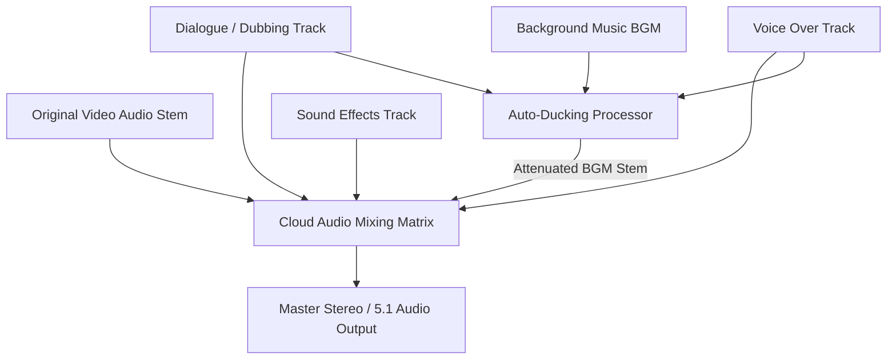

# Audio Production, Subtitles & Auto-Ducking

> **Canonical Document Location:** [`project-docs/30_PRODUCT/AUDIO_EDITING_MODEL.md`](project-docs/30_PRODUCT/AUDIO_EDITING_MODEL.md)

---

## 1. Multi-Track Audio Architecture

Orbis Video Studio AI features a multi-track audio engine designed to assemble dialogue, voice overs, background music, and sound effects into a balanced master mix.

---

## 2. Audio Stem Categorization

| Track Type | Source / Provider | Priority Level | Default Volume (dB) |
| :--- | :--- | :--- | :--- |
| **Dialogue / Dubbing** | Text-to-Speech (TTS) / Recorded Dub | High (Priority 1) | 0 dB (Reference) |
| **Voice Over (VO)** | TTS Voice Model / Voice Clone | High (Priority 1) | 0 dB (Reference) |
| **Original Audio** | Audio extracted from imported video clips | Medium (Priority 2) | -3 dB |
| **Background Music (BGM)**| Stock Audio Library / AI Music Gen | Low (Priority 3) | -12 dB (Ducked to -20 dB) |
| **Sound Effects (SFX)** | SFX Library (foley, transitions) | Medium (Priority 2) | -6 dB |

---

## 3. Auto-Ducking Algorithm Specification

To ensure speech intelligibility without manual sound engineering:
1. **Sidechain Compression Trigger:** The Auto-Ducking Processor monitors signal levels on `Dialogue` and `VO` tracks.
2. **Threshold:** When dialogue signal exceeds `-30 dBFS`, ducking triggers.
3. **Attenuation:** BGM track volume is automatically ducked by `-8 dB` to `-14 dB`.
4. **Attack / Release Time:**
   - **Attack Time:** 150 ms (smooth fade down as speech begins).
   - **Hold Time:** 300 ms (holds attenuation during short pauses).
   - **Release Time:** 400 ms (smooth fade back to nominal BGM volume).

---

## 4. Subtitle Generation & Overlay

- **Automatic SRT / VTT Generation:** Voice Over and Dialogue timing logs automatically generate subtitle timestamps.
- **Rendering Modes:**
  - **Soft Subtitles:** Subtitles exported as separate `.srt` or `.vtt` sidecar files (selectable in video player).
  - **Hard-Burned Subtitles:** Subtitles permanently burned into video frames during cloud rendering (essential for TikTok / Shorts / Reels presets).
