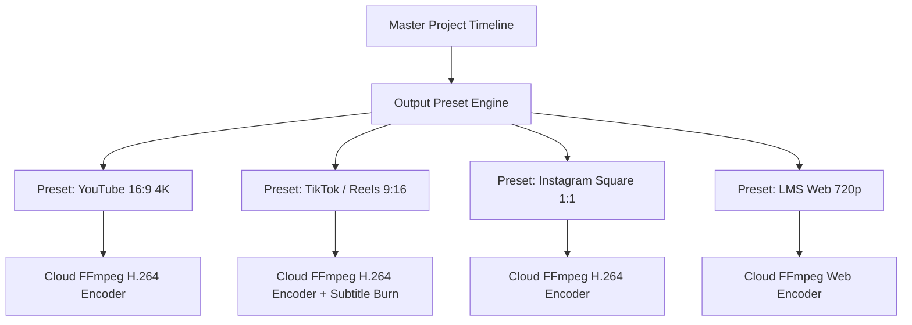

# Output Model & Multi-Platform Profiles

> **Canonical Document Location:** [`project-docs/30_PRODUCT/OUTPUT_MODEL.md`](file:///c:/Users/allda/Desktop/Dev/git/Orbis%20Video%20Studio%20AI/project-docs/30_PRODUCT/OUTPUT_MODEL.md)

---

## 1. Master Output Architecture

The Output Engine translates a Master Project timeline into platform-optimized MP4 files based on configurable export profiles.

---

## 2. Platform Output Presets

### Preset Specifications Table

| Preset Identifier | Target Platform | Container | Aspect Ratio | Dimensions | Max FPS | Video Codec | Audio Codec |
| :--- | :--- | :--- | :--- | :--- | :--- | :--- | :--- |
| `YT_MASTER_4K` | YouTube Master | MP4 | `16:9` | 3840x2160 | 60 | H.264 (High) | AAC 320kbps |
| `YT_STANDARD_1080P` | YouTube Standard | MP4 | `16:9` | 1920x1080 | 30 | H.264 (Main) | AAC 192kbps |
| `TIKTOK_REELS_9X16` | TikTok / Instagram Reels | MP4 | `9:16` | 1080x1920 | 30 | H.264 (Main) | AAC 192kbps |
| `INSTAGRAM_SQUARE` | Instagram Feed | MP4 | `1:1` | 1080x1080 | 30 | H.264 (Main) | AAC 160kbps |
| `LMS_WEB_720P` | Corporate LMS / Web | MP4 | `16:9` | 1280x720 | 25 | H.264 (Baseline)| AAC 128kbps |

---

## 3. Render Profile Overrides

Users can customize preset parameters at render time:
- **Audio Language Selection:** Select active VO language stem (e.g. English vs Thai vs Dual-audio).
- **Subtitle Overlay:** Enable/disable hard-burned subtitles or attach `.srt` sidecars.
- **Resolution & Bitrate Overrides:** Adjust target bitrate (Mbps) for low-bandwidth environments.
- **Watermark Preset:** Apply custom corporate logo overlay to corner coordinates.
