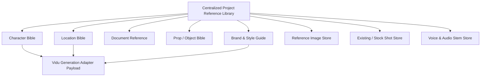

# Centralized Reference Library Model

> **Canonical Document Location:** [`project-docs/30_PRODUCT/REFERENCE_LIBRARY_MODEL.md`](file:///c:/Users/allda/Desktop/Dev/git/Orbis%20Video%20Studio%20AI/project-docs/30_PRODUCT/REFERENCE_LIBRARY_MODEL.md)

---

## 1. Reference Library Overview

Visual and acoustic consistency across shots is maintained through a project-level **Reference Library**. All generation jobs reference canonical items stored in this library.

---

## 2. Reference Asset Types

| Asset Type | Description | Key Properties / Payload |
| :--- | :--- | :--- |
| **Character Bible** | Canonical visual appearance of key characters. | Front/side turnaround images, facial embeddings, voice profile ID, wardrobe tag. |
| **Location Bible** | Key environmental backgrounds and architectural settings. | Environment photographs, lighting style, color palette, architectural tags. |
| **Document Reference** | Uploaded briefs, brand manuals, and source docs. | Parsed text, vector embeddings, structural metadata. |
| **Prop / Object** | Key hero items (e.g. magic sword, vintage car, product package). | Product CAD renderings, multi-angle images, scale metadata. |
| **Brand & Style Guide** | Visual tone, color grading, art style directives. | Style prompt prefix, lut preset, negative prompt rules, brand logo overlay. |
| **Reference Image** | Moodboards and keyframe illustrations. | High-res image storage key, visual similarity vectors. |
| **Existing / Stock Shot** | Pre-rendered or imported video footage clips. | Media URL, duration, framerate, trim points. |
| **Audio Reference** | Custom voice clones, sound effects, or brand audio logos. | Audio stem storage URL, sample rate, voice model identifier. |

---

## 3. Visual Consistency & Vidu Integration

When submitting shot generation requests to Vidu:
1. The adapter checks if the shot is assigned a **Character Bible** or **Location Bible**.
2. Up to 3 canonical reference image URLs are injected into the provider request payload.
3. Character names in text prompts (e.g., `HERO`) are automatically replaced with canonical character visual descriptors to maximize face and attire consistency.
