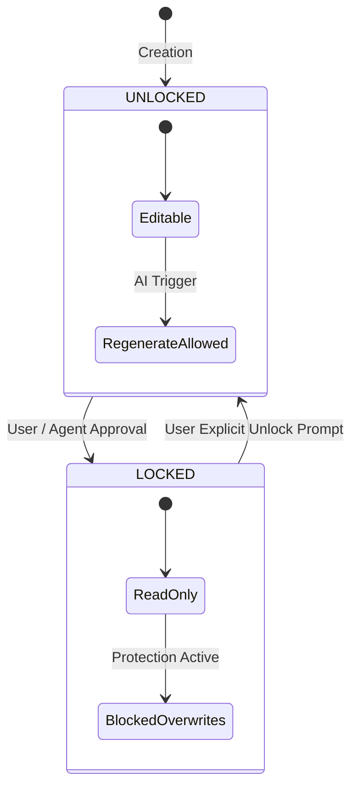

# Scene/Shot Pipeline, Hybrid Shots & Asset Locking

> **Canonical Document Location:** [`project-docs/30_PRODUCT/SCENE_SHOT_MODEL.md`](project-docs/30_PRODUCT/SCENE_SHOT_MODEL.md)

---

## 1. Scene & Shot Hierarchy

Screenplays are broken into a two-level execution hierarchy:

```
PROJECT
  └── SCENE 01: INT. RESEARCH LAB - DAY
        ├── SHOT 01.1 [AI_GENERATED via Vidu] (Wide angle lab setup, 4s)
        ├── SHOT 01.2 [IMPORTED_VIDEO] (Stock footage of microscope lens, 3s)
        └── SHOT 01.3 [MIXED] (AI generated character keyed over imported background, 5s)
```

---

## 2. Hybrid Shot Taxonomy

Every shot in a project is classified under the **Hybrid Shot Workflow**, allowing complete flexibility:

| Shot Classification | Source / Method | Provider / Pipeline |
| :--- | :--- | :--- |
| **`AI_GENERATED`** | Synthesized from prompt + reference images. | Default Vidu Provider Adapter. |
| **`IMPORTED_VIDEO`** | Raw MP4/MOV clip uploaded by user. | Directly placed on timeline (bypasses AI gen). |
| **`IMPORTED_IMAGE`** | Static image (PNG/JPG) uploaded by user. | Rendered with subtle pan/zoom motion. |
| **`RECORDED_FOOTAGE`** | Camera or screen recording uploaded by user. | Directly placed on timeline. |
| **`STOCK_ASSET`** | Sourced from stock media provider. | Downloaded to object storage and attached to shot. |
| **`MIXED`** | Combination (e.g. AI foreground + imported background). | Composited during timeline pre-render. |

---

## 3. Asset Locking State Machine

To prevent accidental regeneration or overwrite of approved production elements, entities support granular **LOCK** states.



### Lockable Entities
- **Script Lock:** Prevents screenplay text re-generation.
- **Scene Lock:** Prevents scene heading, location reference, or shot ordering changes.
- **Shot Lock:** Protects prompt, motion parameters, and generated video clip URL from overwrite.
- **Character Lock:** Locks character appearance images and voice profile.
- **Timing Lock:** Prevents timeline start/end clip trimming changes.

---

## 4. Selective Regeneration Engine

When a user requests video regeneration:
1. System filters target shots requested by user.
2. Evaluates the `is_locked` status of each target shot.
3. **If `LOCKED`:** Regeneration is BLOCKED. User must explicitly unlock the shot first.
4. **If `UNLOCKED`:** System dispatches job to Vidu Provider Adapter.
5. Unaffected shots are untouched, preserving budget and generation state.
