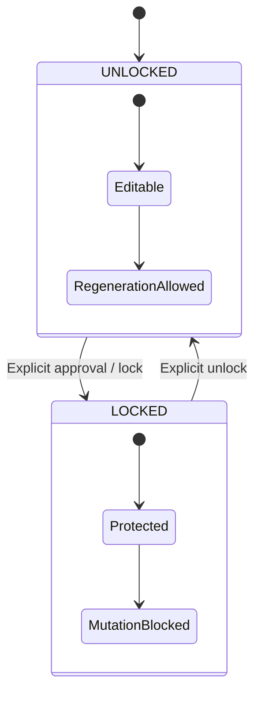

# Scene/Shot Pipeline, Hybrid Shots & Asset Locking

> **Canonical Document Location:** [`project-docs/30_PRODUCT/SCENE_SHOT_MODEL.md`](project-docs/30_PRODUCT/SCENE_SHOT_MODEL.md)

---

## 1. Mode-Aware Scene & Shot Hierarchy

Scene and Shot are reusable execution entities across all production modes.

Examples:

```text
STORY
PROJECT -> STORY -> SCRIPT -> SCENES -> SHOTS

SHORT
PROJECT -> HOOK/CONCEPT -> SCENE(S) -> SHOTS

LOOP
PROJECT -> LOOP SPEC -> SHOT(S)

SCENE
PROJECT -> ONE LOGICAL SCENE -> 1-N SHOTS
```

Core Shot logic must not require a complete Story when the selected Video Mode intentionally bypasses it.

---

## 2. Hybrid Shot Taxonomy

| Shot Classification | Source / Method | Pipeline |
| :--- | :--- | :--- |
| `AI_GENERATED` | Prompt + references | Provider-neutral generation service / WP007 durable queue |
| `IMPORTED_VIDEO` | Uploaded MP4/MOV clip | Existing Asset/object-storage path |
| `IMPORTED_IMAGE` | Uploaded image | Asset path; later timeline motion treatment where applicable |
| `RECORDED_FOOTAGE` | Camera/screen recording | Existing Asset/object-storage path |
| `STOCK_ASSET` | Sourced stock media | Ingest into governed storage before normal use |
| `MIXED` | Combination of generated/imported elements | Composition/timeline path; provider-specific logic remains isolated |

AI-generated Shot services must not call Vidu directly; they dispatch through the provider-neutral boundary established by WP007.

---

## 3. Asset Lock State Machine



Lockable targets may include:
- Script
- Scene
- Shot
- Character
- Location
- Voice
- Timing

Rules:
- locked entities cannot be silently overwritten or regenerated
- unlock is explicit and auditable
- compound operations affecting a locked dependency fail closed
- locks must remain compatible with selective regeneration and mode-specific workflows

---

## 4. Configuration Inheritance

```text
Project
  ↓
Scene
  ↓
Shot
```

Mode defaults begin at Project level. Scene and Shot overrides are allowed only where validation and lock rules permit them.

---

## 5. Selective Regeneration Compatibility

The later selective-regeneration service will:
1. identify target shots
2. reject locked targets/dependencies
3. preserve unaffected shots
4. dispatch only eligible AI-generated work through the provider-neutral queue
5. avoid unnecessary project-wide regeneration

WP008 may establish the lock/hybrid foundations but must not silently absorb WP011 implementation scope.

---

## 6. WP008 Routing

P2-WP008 is the earliest planned implementation point for:
- Hybrid Shot Engine
- Asset Lock Machine
- base Video Mode configuration for STORY / SHORT / LOOP / SCENE

Status remains **PROPOSED / NOT AUTHORIZED** until explicit Owner approval.
