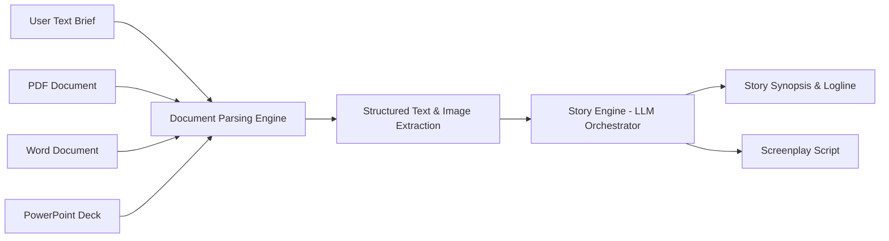

# Story & Script Engine Model

> **Canonical Document Location:** [`project-docs/30_PRODUCT/STORY_SCRIPT_MODEL.md`](file:///c:/Users/allda/Desktop/Dev/git/Orbis%20Video%20Studio%20AI/project-docs/30_PRODUCT/STORY_SCRIPT_MODEL.md)

---

## 1. Document Ingestion Pipeline

The Document Ingestion Engine parses raw source material into a structured narrative context.



---

## 2. Ingestion Capabilities

- **PDF Parser:** Extracts raw text, headings, page structure, and embedded images.
- **Word (.docx) Parser:** Extracts paragraph hierarchy, character dialogue formatting, and inline images.
- **PowerPoint (.pptx) Parser:** Extracts slide titles, bullet points, speaker notes, and visual assets.
- **Text / Markdown Parser:** Directly ingests raw briefs and structured storyboards.

---

## 3. Screenplay Script Formatting & Structural Extraction

The Script Engine structures stories into standard screenplay format:

```fountain
EXT. CYBERPUNK CITY STREET - NIGHT

Rain falls past neon signs. HERO (30s, leather jacket) stands in the alley, eyes locked on a glowing drone.

HERO
(whispering)
They found us.

Hero sprint into the dark street as the drone fires a blue laser grid.
```

### Automatic Parsing Rules
1. **Scene Headings (`INT.` / `EXT.`):** Automatically split script into numbered **Scenes**.
2. **Action Blocks:** Parsed into visual environment descriptions for shot prompt generation.
3. **Character Names & Parentheticals:** Extracted and linked to Character Reference Bibles.
4. **Dialogue Lines:** Extracted into Audio Dubbing / Text-to-Speech (TTS) stem queues.
