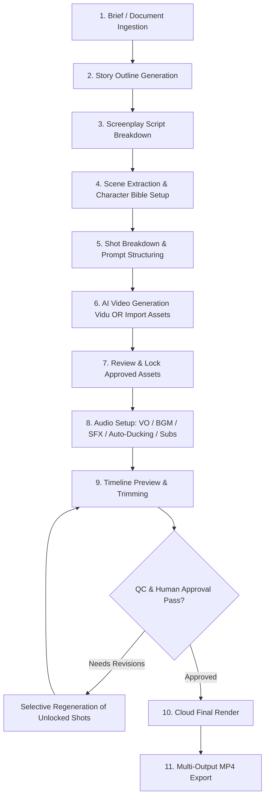

# User Production Workflow

> **Canonical Document Location:** [`project-docs/30_PRODUCT/USER_WORKFLOW.md`](file:///c:/Users/allda/Desktop/Dev/git/Orbis%20Video%20Studio%20AI/project-docs/30_PRODUCT/USER_WORKFLOW.md)

---

## 1. End-to-End Production Flow Diagram

---

## 2. Stage-by-Stage User Journey

### Stage 1: Brief & Document Ingestion
- User creates project in Web UI.
- Uploads reference material (PDF script, Word brief, PowerPoint deck, character reference images, brand style guides).

### Stage 2: Story & Script Breakdown
- System parses documents and generates narrative Story synopsis.
- User reviews, edits, and approves screenplay Script.
- System automatically splits script into discrete **Scenes** and camera **Shots**.

### Stage 3: Reference Bible & Asset Mapping
- User assigns Character Bibles (face/style images) and Location Bibles to scenes.
- System attaches reference assets to shot generation prompts.

### Stage 4: Shot Generation & Hybrid Import
- User triggers AI video generation via Vidu adapter for designated shots.
- For non-AI shots, user uploads existing video clips, recorded footage, or stock media.

### Stage 5: Asset Locking & Quality Control
- User reviews generated shot clips.
- User clicks **LOCK** on satisfactory scripts, scenes, shots, or character voices. Locked items are protected against accidental regeneration.

### Stage 6: Audio Production & Timeline Editing
- User configures Text-to-Speech (TTS) Voice Overs or uploads recorded dubbing.
- Adds BGM and SFX tracks. System applies auto-ducking to lower music volume during dialogue.
- System auto-generates subtitles. User adjusts shot timing on the simplified timeline.

### Stage 7: Selective Regeneration & Final Cloud Export
- If specific shots require improvement, user regenerates ONLY target unlocked shots.
- User approves final preview and submits job to Cloud Render Engine.
- Cloud FFmpeg workers encode master MP4 file and multi-platform output variants.
