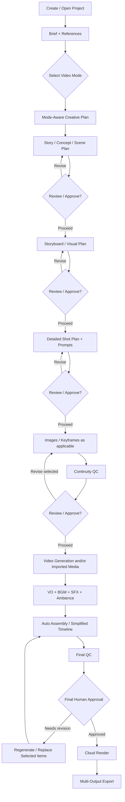

# User Production Workflow

> **Canonical Document Location:** [`project-docs/30_PRODUCT/USER_WORKFLOW.md`](project-docs/30_PRODUCT/USER_WORKFLOW.md)

---

## 1. Guided, Approval-Gated End-to-End Flow

Orbis should automate repetitive production work while allowing the user to stop and review before expensive downstream generation.



Full Auto may skip intermediate pauses only when the user explicitly chooses that behavior. Safe staged review remains available.

---

## 2. Stage-by-Stage Journey

### Stage 1 — Project Setup

User creates or opens one of many projects and provides:
- Video Mode
- Purpose / target audience / platform
- preferred aspect ratio / duration where known
- brief, documents, prompts and references
- automation preference where exposed

The system should use safe defaults and avoid forcing first-time users to configure provider/model details.

### Stage 2 — Mode-Aware Creative Structure

- **STORY:** Story / Script / Scenes / Shots as required.
- **SHORT:** Hook/Concept / compact Scene / Shots; full Story optional.
- **LOOP:** Loop Specification / Shot(s); Story/Script optional.
- **SCENE:** Scene / 1-N Shots; Story optional.

The system should create only the structural layers required by the chosen mode.

### Stage 3 — Story Review

The user can inspect and edit the creative direction before any detailed shot/image/video generation.

Recommended next action should be explicit, for example:

```text
Story ready -> Review Story
Story approved -> Create Storyboard
```

### Stage 4 — Storyboard Review

Storyboard is a reviewable visual/planning layer. It may use planning cards/placeholders before real generated media exists.

The user can validate:
- scene flow
- pacing
- visual direction
- continuity intent
- whether scenes should be added/removed/reordered

No chargeable video generation should happen merely because Storyboard exists.

### Stage 5 — Detailed Shot Planning

After the user proceeds, the system creates detailed shots/prompts/camera/duration/reference mapping as applicable.

The user can review/approve or edit selected shots before generation.

### Stage 6 — Image / Keyframe Generation

Where useful, generate storyboard images or keyframes through a provider-neutral ImageProvider pipeline.

Batch generation should support:
- Generate Selected
- Generate All Eligible
- Retry Failed
- Continue Incomplete

Completed historical assets must not be silently overwritten.

### Stage 7 — Video Generation

Eligible unlocked shots are generated through the provider-neutral durable generation queue.

The UI should show truthful actionable states such as Queued, Generating, Completed, Failed, Reconciliation Required and any safe recovery action.

### Stage 8 — Audio Production

Core V1 supports:
- VO
- BGM
- SFX
- Ambience
- basic volume / mute / fade
- basic auto-ducking
- project-level/batch audio planning and generation/assignment

Advanced DAW-style editing is not required in V1.

### Stage 9 — Assembly / QC / Final Review

Orbis assembles approved shots/audio into a previewable production, checks missing/failed/continuity issues and presents a final review state.

Final render remains gated by explicit human approval.

### Stage 10 — Render / Multi-Output Export

One approved master project can produce approved output variants such as 16:9, 9:16 and 1:1 without rebuilding the creative project.

---

## 3. Guided Flexibility Rules

1. Always show one clear primary recommended action based on project state.
2. Keep secondary/advanced actions available but visually subordinate.
3. Use plain-language helper text and explain why an action is recommended.
4. Use progressive disclosure: provider/model/technical controls are Advanced by default.
5. Empty/error/blocked states must show a safe recovery path.
6. Known expensive actions should expose cost/estimate when available; unknown cost must remain explicitly UNKNOWN.
7. Prefer selected/incomplete regeneration over restarting completed work.
8. Do not force every mode through identical stages when the stage is not applicable.
9. Preserve expert control: users can go back, edit, reorder, restore prior versions and inspect history.

---

## 4. History & Safety Rules

- Multi-project is required.
- Important production changes are auditable.
- Regeneration creates lineage/version evidence instead of silently destroying prior evidence.
- Archive is preferred over destructive deletion for normal project lifecycle actions.
- Locked/approved entities cannot be silently overwritten.
- Resume/retry continues incomplete work instead of duplicating completed chargeable work.

---

## 5. Workflow Rule

Story is not mandatory for every Project. `video_mode` determines which creative stages are required.

The product is automation-first, but human approval remains final authority.

See [`VIDEO_PRODUCTION_MODES.md`](VIDEO_PRODUCTION_MODES.md) for canonical mode behavior.
