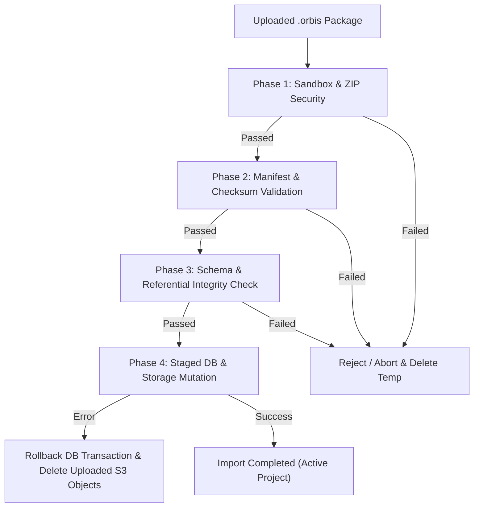

# P4-WP019 Proposal — Project Export/Import Archive Package (.orbis)

> **Document Type:** Architectural Proposal & PRE1 Acceptance Contract  
> **Status:** PRE1 / PROPOSAL IN REVIEW (IMPLEMENTATION NOT AUTHORIZED)  
> **Target Work Package:** P4-WP019 — Project Export/Import Archive Package (.orbis)  
> **Parent Phase:** Phase 4 — Multi-Output, Export & Core V1 Release  

---

## 1. Objective

Define a secure, durable, versioned, and self-contained container format (`.orbis`) and lifecycle engine to export an entire Orbis Video Studio AI project into an archive and import it into another or the same Orbis instance without data corruption, security vulnerabilities, or silent history loss.

This specification satisfies four fundamental core locks:
- **`PROJECT PORTABILITY`**: A complete Orbis project can be moved across environments or backed up deterministically.
- **`FULL_HISTORY_RETENTION`**: Project structure, historical versions, audit trails, and lineage are preserved across export/import cycles.
- **`AUDITABLE_CHANGES`**: Import and export operations leave unambiguous, tamper-evident audit records.
- **`NO_SILENT_HISTORY_LOSS`**: Schema differences, collision decisions, or excluded elements fail closed with explicit logging rather than silent omissions.

---

## 2. Current Repository Evidence

Comprehensive inspection of the current repository reveals the exact data surface, storage architecture, and existing project management primitives:

1. **Project & Story Structure (`app/models/project.py`, `story.py`, `story_version.py`, `scene.py`, `shot.py`)**:
   - `Project` has UUID primary key, `video_mode` (STORY, SHORT, LOOP, SCENE), `automation_mode`, `mode_config`, `default_config`, and budget fields.
   - `Story` is 1-to-1 with `Project`, maintaining `version_number` and child `StoryVersion` rows.
   - `Scene` references `project_id` and/or `story_id`, containing ordering, heading, dialogue, narration, and `scene_config`.
   - `Shot` belongs to `Scene`, has `shot_number`, `shot_type`, `visual_prompt`, `camera`, `duration_seconds`, locks, and optional foreign keys: `source_asset_id` and `keyframe_asset_id` to `Asset`.
2. **Asset Management & Object Storage (`app/models/asset.py`, `app/services/storage/`)**:
   - `Asset` tracks `name`, `original_filename`, `asset_type`, `content_type`, `file_size_bytes`, `checksum_sha256`, `storage_bucket`, and `storage_key`.
   - `ObjectStorageProvider` (`app/services/storage/base.py`) specifies `get_object`, `put_object`, `delete_object`, `upload_file_object`, `download_file_object`, and `generate_presigned_url`.
   - `DocumentExtraction` (`app/models/document_extraction.py`) holds 1-to-1 extraction text and segment data for ingested script/reference assets.
3. **Reference Library & Continuity Bibles (`app/models/reference_library.py`, `asset_lock.py`)**:
   - Five reference entities: `ProjectReference`, `CharacterBible`, `LocationBible`, `StyleBible`, and `BrandBible`. Each points to `projects.id` with optional foreign keys to `assets.id`.
   - `AssetLock` (`app/models/asset_lock.py`) enforces entity-level locks (`entity_type`, `entity_id`) uniquely across the project.
4. **Audio Production (`app/models/audio_plan.py`, `audio_clip.py`, `audio_history.py`)**:
   - `AudioPlan` (1-to-1 per project) with `AudioPlanVersion`.
   - `AudioClip` (project/scene/shot scoped, ducking role, volume, pan, fades) with child `AudioClipHistory` records and FKs to audio and video `Asset`.
5. **Timeline Assembly (`app/models/assembly.py`)**:
   - `AssemblyTimeline` (`version`, `is_active`, `status`) with child `AssemblyScene`, `AssemblyShotPlacement` (overrides, trims, locks, transitions, visual asset FK), `TimelineCheckpoint`, and `TimelineAudit`.
6. **QC, Findings & Approvals (`app/models/qc.py`)**:
   - `QCRun`, `QCFinding` (BLOCKER/WARNING), `WarningDecision` (decision sequence audit), and `ApprovalRecord` (`uq_production_approvals_project_timeline`).
7. **Render & Export Pipeline (`app/models/render_job.py`, `render_batch.py`)**:
   - `RenderBatch` grouping multi-output variants.
   - `RenderJob` holding `render_variant_key`, `render_profile`, `idempotency_key`, `output_asset_id`, and partial unique active variant index `uq_render_jobs_active_variant`.
8. **Generation Jobs & Batch Resume (`app/models/generation_job.py`, `batch_run.py`, `generation_audit.py`)**:
   - `GenerationJob` tied to `Shot`, tracking provider job states and output assets.
   - `BatchRun` and `BatchRunItem` tracking batch dispatch decisions and skip reasons.
   - `GenerationAuditLog` logging provider request token/character counts and latencies.
9. **Cost Control & Ledger (`app/models/usage_ledger.py`)**:
   - `UsageLedger` and `LedgerAdjustment` tracking estimated vs actual costs, currency, and provider events with partial unique idempotency keys.
10. **Existing Portability / Duplication Primitives (`app/api/v1/endpoints/projects.py:duplicate_project`)**:
    - Current duplicate endpoint only copies `Project`, `Scene`, and `Shot` with new UUIDs. It completely omits Story versions, Assets, Bibles, Audio, Assembly, QC, Approvals, RenderJobs, and Ledgers. There is currently no archive packaging or export/import functionality.

---

## 3. Locked Scope (WP019 Required)

WP019 delivers the following bounded capabilities:
1. **Archive Container (`.orbis`)**: A standard, unencrypted ZIP container adhering to the canonical Orbis Archive Specification v1.0.
2. **Archive Manifest (`manifest.json`)**: Deterministic metadata tracking archive format version, Orbis schema version, project identity, timestamps, generator information, and cryptographic checksums for all archive members.
3. **Deterministic Entity Serialization**: Structured JSON serialization of the full project dependency graph.
4. **Asset Archival Strategy**:
   - Self-contained packaging of all required project assets (source uploads, keyframe images, video clips, audio tracks, and approved master/variant renders).
   - Cryptographic SHA-256 validation of all embedded binaries against database records.
5. **Two Import Semantics**:
   - **`CLONE` Mode (Default)**: Import as an entirely new project, generating fresh UUIDs for all entities while retaining source archive lineage metadata.
   - **`RESTORE` Mode**: Restore a project into an instance, preserving original UUIDs if no collision exists; fail closed with explicit diagnostic reporting if an ID collision occurs.
6. **Robust Referential ID Remapping Engine**: In-memory graph mapper mapping `old_uuid -> new_uuid` across all parent-child, foreign key, polymorphic lock (`entity_type`, `entity_id`), and metadata relationships.
7. **Fail-Closed Transactional Import**:
   - Strict 4-phase import pipeline: Inspection & Sandbox Unpack -> Pre-flight Validation -> Staged Database Mutation -> Storage Promotion.
   - Atomic database rollback and automated storage cleanup on any failure.
8. **Security Hardening**: Protection against ZIP Slip (path traversal), decompression bombs, excessive file counts, duplicate file headers, corrupted checksums, and secret leakage. Strict path validation allows only normalized relative POSIX-style paths (`entities/story.json`, `assets/data/file.mp4`) and rejects absolute, leading-slash, Windows drive, UNC, backslash, traversal (`..`), and non-regular entries.
9. **Sanitized Configuration (No Secret Leakage)**: Strict redaction/exclusion of provider API keys, authorization tokens, presigned URLs, and machine-local credential paths.
10. **Preservation of Historical Execution Truth & Dual Authority Exclusion**: Historical `RenderJob` and `GenerationJob` records preserve their original execution status, attempts, errors, and timestamps exactly as historical truth (no rewriting of status to `CANCELLED`). Imported historical rows are strictly excluded from BOTH:
    - **Live Execution Authority**: Background workers, queue dispatchers, and polling services strictly filter out jobs where `imported_historical IS TRUE` or `execution_disabled IS TRUE`.
    - **Live Active Uniqueness Authority**: Database partial unique indexes (`uq_render_jobs_active_variant` and `uq_generation_jobs_active_shot`) and application active-check queries are updated to apply only when `imported_historical IS NOT TRUE`. Imported historical rows never block the submission or execution of legitimate new live jobs for the same timeline variant or shot.
11. **Preservation of Historical Financial Truth**: Historical `UsageLedger` and `LedgerAdjustment` entries preserve their original `cost_status`, `estimated_cost`, `actual_cost`, currency, and timestamps bit-for-bit (no rewriting of status to `ARCHIVED_IMPORT`). Rows are tagged with `imported_historical = True`. Live budget calculations strictly exclude rows where `imported_historical IS TRUE`, preventing double-counting or re-charging without altering historical financial truth.
12. **Minimal V1 UI / API**:
    - Backend endpoints for export generation and streaming download, and import upload, pre-flight validation, and execution.
    - Frontend dashboard actions: "Export .orbis" and "Import Project".

---

## 4. Explicit Out-of-Scope

The following items are strictly out-of-scope for WP019:
- Real-time cloud sync or live project replication between Orbis instances.
- Git-like branch/merge or collaborative conflict resolution for concurrent project editing.
- Public template marketplace, asset store, or cloud discovery services.
- Multi-project batch archive bundling (one `.orbis` archive = exactly one project).
- Social platform direct publishing from archives.
- Export of external AI provider credentials or API accounts.
- Proprietary DRM, password protection, or archive-level symmetric encryption (standard filesystem and transmission security apply).
- Automated transcoding or format translation of media assets during export/import (assets are preserved bit-for-bit).
- P4-WP020 End-to-End System Integration, UAT & Core V1 Release activities.

---

## 5. Archive Format Proposal (`.orbis`)

An `.orbis` package is a standard ZIP archive (`application/x-orbis-archive` or `application/zip`) containing a deterministic folder layout:

```text
my-project.orbis (ZIP)
├── manifest.json                  # Archive metadata, schema versions, member checksums
├── project.json                   # Root Project entity definition & mode config
├── entities/                      # Normalized relational entity datasets (JSON)
│   ├── story.json                 # Story & StoryVersion history
│   ├── scenes.json                # Scenes list & ordering
│   ├── shots.json                 # Shots & shot configs
│   ├── reference_library.json     # ProjectReference, Character/Location/Style/Brand bibles
│   ├── asset_locks.json           # Entity lock records
│   ├── audio.json                 # AudioPlan, AudioPlanVersion, AudioClip, AudioClipHistory
│   ├── assembly.json              # AssemblyTimeline, AssemblyScene, ShotPlacement, Checkpoints
│   ├── qc.json                    # QCRuns, QCFindings, WarningDecisions, Approvals
│   ├── render_jobs.json           # RenderBatch and RenderJob records
│   ├── generation_jobs.json       # GenerationJob, BatchRun, BatchRunItem records
│   └── document_extractions.json  # Ingestion extraction text & segments
├── assets/                        # Content-addressed binary assets
│   ├── manifest.json              # Asset catalog mapping asset_id -> relative archive path
│   └── data/                      # Binaries named by SHA-256 checksum or UUID
│       ├── 3a7b...4f8e.mp4
│       ├── b89c...1102.png
│       └── ...
├── history/                       # Audit & Ledger historical logs (JSON)
│   ├── usage_ledger.json          # Historical UsageLedger & LedgerAdjustment records
│   ├── orchestration_audit.json   # OrchestrationAudit state transition records
│   ├── generation_audit.json      # GenerationAuditLog provider telemetry
│   └── timeline_audits.json       # TimelineAudit changelog
└── checksums.sha256               # Raw SHA-256 manifest of every file in the ZIP
```

### Container Principles & Path Specification
1. **Archive Compression Policy**: ZIP `deflate` (standard compression level 6) for JSON manifests; `store` (0 compression) or light `deflate` for media binaries (MP4, PNG, JPG, WAV) to optimize creation and extraction speed without wasteful double compression.
2. **Canonical Relative Path Format**: All paths inside the archive MUST be canonical POSIX-style relative paths using forward slashes (`/`) as delimiters.
   - **ALLOW**: Normalized relative POSIX-style paths (e.g. `manifest.json`, `project.json`, `entities/story.json`, `assets/data/3a7b...4f8e.mp4`, `history/usage_ledger.json`).
   - **REJECT**:
     - Absolute paths (e.g. `/etc/passwd`, `/manifest.json`, `\Windows\System32\...`).
     - Leading forward slashes (`/`) or leading backslashes (`\`).
     - Windows drive-letter paths (e.g. `C:file.txt`, `D:\data\...`, `C:/data/...`).
     - UNC paths (e.g. `\\server\share\...`, `//server/share/...`).
     - Backslashes (`\`) anywhere in the path string (canonical archive format strictly requires `/`).
     - Traversal path segments (`.` or `..`, e.g. `../entities/story.json`, `entities/../story.json`).
     - Empty or ambiguous path segments (e.g. `entities//story.json`, trailing slashes for non-directories).
     - Canonicalized paths that escape the extraction sandbox: verify `os.path.commonpath([sandbox_dir, target_path]) == sandbox_dir`.
     - Non-regular entries: Symlinks (`S_IFLNK`), hardlinks, FIFOs, device nodes, or sockets.
3. **Non-Circular Checksum Trust Root**:
   - **`manifest.json`**: Contains SHA-256 hashes and byte lengths for all payload members (all files under `project.json`, `entities/`, `assets/`, and `history/`). `manifest.json` does NOT contain a hash for itself or for `checksums.sha256`.
   - **Deterministic Canonical Serialization**: `manifest.json` is serialized using Canonical JSON (RFC 8785 / JCS: recursively sorted dictionary keys, no insignificant whitespace between tokens, UTF-8 encoding without BOM, normalized Unicode NFC).
   - **`checksums.sha256`**: Serves as the non-circular cryptographic trust root for the archive. It contains standard GNU coreutils format lines: `<64-hex-sha256>  <normalized-relative-path>\n` for:
     - Every payload member file in the archive.
     - `manifest.json`.
   - **Exclusion**: `checksums.sha256` does NOT include a hash for itself.
   - **Formatting & Sorting Rules**:
     - Encoding: UTF-8 without BOM.
     - Newline: Strictly UNIX LF (`\n`, `0x0A`).
     - Sorting: Entries are lexicographically sorted by normalized relative path in ASCII byte order.
     - Separator: Exactly two ASCII spaces (`0x20 0x20`) between the 64-character lowercase hexadecimal hash and the relative path.

---

## 6. Manifest Schema Proposal (`manifest.json`)

```json
{
  "$schema": "https://orbis.video/schemas/v1/archive-manifest.json",
  "archive_format_version": "1.0.0",
  "schema_version": "1.0.0",
  "generator": {
    "system": "Orbis Video Studio AI",
    "version": "1.0.0-core-v1",
    "git_commit": "351fc5088cf3ce8251d9ee896f44f1996897b608",
    "exported_at": "2026-09-07T20:30:00Z"
  },
  "project": {
    "original_project_id": "7c9e6679-7425-40de-944b-e07fc1f90ae7",
    "title": "Neon Cyberpunk Short",
    "video_mode": "SHORT",
    "automation_mode": "MANUAL",
    "created_at": "2026-09-01T12:00:00Z",
    "updated_at": "2026-09-07T18:00:00Z"
  },
  "archive_options": {
    "package_type": "FULL_SELF_CONTAINED",
    "include_history": true,
    "include_renders": true
  },
  "entity_counts": {
    "stories": 1,
    "story_versions": 3,
    "scenes": 4,
    "shots": 16,
    "assets": 22,
    "asset_locks": 5,
    "audio_clips": 8,
    "timelines": 2,
    "qc_runs": 2,
    "approvals": 1,
    "render_jobs": 3,
    "usage_ledger_entries": 25
  },
  "assets_summary": {
    "total_count": 22,
    "total_size_bytes": 145829104,
    "embedded_count": 22,
    "reference_only_count": 0
  },
  "file_manifest": {
    "project.json": {
      "sha256": "4b227777d4dd1fc61c6f884f48641d02b4d121d3fd328cb08b5531fcacdabf8a",
      "size_bytes": 1842
    },
    "entities/story.json": {
      "sha256": "e3b0c44298fc1c149afbf4c8996fb92427ae41e4649b934ca495991b7852b855",
      "size_bytes": 4510
    },
    "assets/data/3a7b...4f8e.mp4": {
      "sha256": "3a7b68731d798f86f776269df7cb1135f5c531cb489c7d41f021e1ff3b594f8e",
      "size_bytes": 12845012,
      "asset_id": "b3e0c071-3cb5-4f40-8b17-7435f3dfd720"
    }
  }
}
```

---

## 7. Entity Coverage Matrix

| Entity | DB Model | Export Inclusion | Import Treatment | Notes / Safety Rule |
| :--- | :--- | :--- | :--- | :--- |
| **Project** | `Project` | REQUIRED | Create (Clone: new UUID; Restore: existing UUID) | Base settings, video mode, budget limits. |
| **Story** | `Story` | REQUIRED | Re-link to new Project | 1-to-1 root story outline, logline, synopsis. |
| **StoryVersion** | `StoryVersion` | REQUIRED | Re-link to Story & Project | Preserves full narrative revision history. |
| **Scene** | `Scene` | REQUIRED | Remap UUIDs, order preserved | Scenes hierarchy, heading, dialogue, config. |
| **Shot** | `Shot` | REQUIRED | Remap UUIDs, re-link assets | Visual prompts, camera, durations, status. |
| **Asset** | `Asset` | REQUIRED | Re-register in storage & DB | Validated via SHA-256, mapped to new keys. |
| **Doc Extraction**| `DocumentExtraction`| REQUIRED | Remap to new Asset ID | Ingested script text, segments, counts. |
| **Project Ref** | `ProjectReference` | REQUIRED | Remap to Project & Asset | Reference assets, category, metadata. |
| **Bibles** | `Character/Location/Style/Brand` | REQUIRED | Remap to Project & Assets | Preserves character/location/brand context. |
| **Asset Locks** | `AssetLock` | REQUIRED | Remap `entity_id` based on type | Reconstructs user locks accurately. |
| **Audio Plan** | `AudioPlan` | REQUIRED | Remap to Project | Audio configuration and status. |
| **Audio Version** | `AudioPlanVersion` | REQUIRED | Remap to AudioPlan | History of audio plan adjustments. |
| **Audio Clip** | `AudioClip` | REQUIRED | Remap to Project, Scene, Shot, Asset | Tracks mixing, volume, ducking, timing. |
| **Audio History** | `AudioClipHistory` | REQUIRED | Remap to Clip & Asset | Full audit trail of clip iterations. |
| **Assembly** | `AssemblyTimeline` | REQUIRED | Remap to Project | Timeline revisions (`version`, `is_active`). |
| **Assembly Scene**| `AssemblyScene` | REQUIRED | Remap to Timeline & Scene | Ordering of scenes within the timeline. |
| **Shot Placement**| `AssemblyShotPlacement` | REQUIRED | Remap to Scene, Shot, Asset | Non-destructive trims, transitions, locks. |
| **Checkpoints** | `TimelineCheckpoint`| REQUIRED | Remap to Timeline | In-memory timeline snapshots. |
| **Timeline Audit**| `TimelineAudit` | REQUIRED | Remap to Timeline | Auditable timeline change records. |
| **QC Run** | `QCRun` | REQUIRED | Remap to Timeline | QC execution history and finding counts. |
| **QC Finding** | `QCFinding` | REQUIRED | Remap to QCRun & Timeline | BLOCKER / WARNING findings records. |
| **Warning Dec.** | `WarningDecision` | REQUIRED | Remap to Finding & QCRun | Audit trail of accepted warnings with reasons. |
| **Approval** | `ApprovalRecord` | REQUIRED | Remap to Timeline & QCRun | Production sign-off records (`APPROVED`). |
| **Render Batch** | `RenderBatch` | REQUIRED | Remap to Timeline | Multi-output batch groupings. |
| **Render Job** | `RenderJob` | REQUIRED | Remap IDs; **Preserve original status & fields** | Historical record preserved bit-for-bit. Tagged with `imported_historical = True` and `execution_disabled = True`. Excluded from workers and from active partial unique index `uq_render_jobs_active_variant`. Never blocks new live jobs. |
| **Generation Job**| `GenerationJob` | REQUIRED | Remap IDs; **Preserve original status & fields** | Historical record preserved bit-for-bit. Tagged with `imported_historical = True` and `execution_disabled = True`. Excluded from workers and from active partial unique index `uq_generation_jobs_active_shot`. Never blocks new live jobs. |
| **Batch Run** | `BatchRun`, `BatchRunItem`| REQUIRED | Remap to Project & Shot | History of batch generation resume dispatches. |
| **Audit Logs** | `GenerationAuditLog`| OPTIONAL/REQ | Remap to Project | Telemetry history (token counts, latency). |
| **Orchestration** | `OrchestrationAudit`| REQUIRED | Remap to Project | State machine transitions and actor audits. |
| **Usage Ledger** | `UsageLedger`, `Adjustment`| REQUIRED | Remap IDs; **Preserve original status & costs** | Retained for audit bit-for-bit. Tagged with `imported_historical = True`. Live budget calculations ignore `imported_historical` rows without spend double-counting. |

---

## 8. Asset Inclusion Policy

### 8.1 Asset Categories & Treatment
1. **REQUIRED EMBEDDED**:
   - Uploaded source documents and image/video references (`Asset.asset_type IN ('DOCUMENT', 'IMAGE', 'REFERENCE')`).
   - Selected storyboard keyframe images (`Shot.keyframe_asset_id`).
   - Approved generated shot video clips (`Shot.source_asset_id` or `visual_asset_id`).
   - Generated or imported audio files (`AudioClip.asset_id`).
   - Rendered master and preset output video files (`RenderJob.output_asset_id`).
   - Brand logos and bible reference images (`BrandBible.logo_asset_id`, etc.).
2. **OPTIONAL EMBEDDED**:
   - Intermediate, unselected candidate generation artifacts (can be included if user selects "Include all drafts", or omitted in "Clean export").
3. **NEVER EXPORTED**:
   - Temporary local staging files, FFmpeg concat manifests, and scratch scripts.
   - Provider API keys, credentials, or bearer tokens.
   - Presigned S3 URLs containing temporary authentication queries (AWS Signature, etc.).
   - Local filesystem paths specific to the exporting machine.

### 8.2 Asset Packaging & Destination Storage Promotion
- In the `.orbis` package, assets are stored under `assets/data/{checksum}.{ext}`.
- During export, the backend streams asset bytes directly from object storage (`ObjectStorageProvider.download_file_object`) into the archive stream.
- During import:
  1. Each asset file is extracted to a sandboxed temporary directory.
  2. The SHA-256 hash and byte length are verified against the manifest.
  3. If verification passes, the file is uploaded to the destination object storage bucket under a fresh, isolated project storage key: `projects/{new_project_id}/assets/{new_asset_id}/{original_filename}`.
  4. The newly created storage key is assigned to the imported `Asset` database entity.

---

## 9. ID Remapping Strategy

To support **`CLONE`** mode (and **`RESTORE`** mode with remapping), the import service uses a deterministic **Entity Remapping Graph**:

```python
class RemapContext:
    def __init__(self, mode: str, original_project_id: uuid.UUID):
        self.mode = mode
        self.original_project_id = original_project_id
        self.id_map: dict[uuid.UUID, uuid.UUID] = {}
        self.entity_type_map: dict[tuple[str, uuid.UUID], uuid.UUID] = {}

    def get_or_create(self, old_id: uuid.UUID, entity_type: str = "") -> uuid.UUID:
        if self.mode == "RESTORE":
            # In restore mode without collision, preserve original ID
            return old_id
        # In clone mode, allocate new random UUID
        if old_id not in self.id_map:
            new_id = uuid.uuid4()
            self.id_map[old_id] = new_id
            if entity_type:
                self.entity_type_map[(entity_type, old_id)] = new_id
        return self.id_map[old_id]
```

### Remapping Rules:
1. **Hierarchical FK Remapping**:
   - `Project.id` -> `new_project_id`. All entities with `project_id` receive `new_project_id`.
   - `Scene.id` -> `new_scene_id`. All `Shot.scene_id`, `AssemblyScene.scene_id`, `AudioClip.scene_id` point to `new_scene_id`.
   - `Asset.id` -> `new_asset_id`. All FKs (`source_asset_id`, `keyframe_asset_id`, `reference_asset_id`, `visual_asset_id`, `output_asset_id`, `asset_id`) are rewritten to `new_asset_id`.
2. **Polymorphic Remapping (`AssetLock`)**:
   - `AssetLock` stores `entity_type` (e.g., `"SCENE"`, `"SHOT"`, `"PROJECT"`) and `entity_id` (UUID).
   - The remapping engine rewrites `entity_id` by looking up `(entity_type, old_entity_id)` in the remapping table.
3. **Lineage Retention**:
   - In `CLONE` mode, the cloned `Project.mode_config` metadata retains:
     ```json
     {
       "clone_lineage": {
         "source_project_id": "7c9e6679-7425-40de-944b-e07fc1f90ae7",
         "source_archive_checksum": "a8f1...33d2",
         "imported_at": "2026-09-07T20:45:00Z"
       }
     }
     ```

---

## 10. Restore vs Clone Semantics

| Dimension | `CLONE` Mode (Default) | `RESTORE` Mode |
| :--- | :--- | :--- |
| **Intent** | Duplicate/port project as an independent new project. | Restore exact project identity after backup or machine migration. |
| **Project ID** | Always generates fresh UUID. | Attempts to use original archive Project UUID. |
| **Entity IDs** | All entities receive newly minted UUIDs. | Preserves original UUIDs across all entities. |
| **Existing Project Conflict** | None (new ID created). If title matches, appends `(Imported {date})`. | **Fail-closed collision**: If `original_project_id` already exists in DB, import is aborted with `409 Conflict`. |
| **Collision Resolution** | N/A. | User must either delete/archive conflicting project or switch to `CLONE` mode. |
| **Storage Keys** | Assets stored under new project prefix (`projects/{new_id}/...`). | Assets stored under restored project prefix; existing files checked for collision. |
| **Lineage Record** | Writes `clone_lineage` to project metadata. | Writes `restore_audit` to project orchestration audit log. |

---

## 11. Import Validation Pipeline

Import follows a strict 4-phase, fail-closed pipeline:



### Phase Details:
1. **Phase 1: Sandbox & ZIP Security Inspection**:
   - File signature verified (magic bytes `PK\x03\x04`).
   - Archive size checked against max limit (10 GB).
   - Total uncompressed size and entry count verified against compression ratio limits (max expansion ratio 10:1; max 50,000 files).
   - **Canonical Path Normalization & Rejection Contract**:
     - Extract entry metadata without extracting payload.
     - For each entry, examine the raw archive filename:
       - Reject if entry contains backslashes (`\`).
       - Reject if entry has leading forward slashes (`/`) or drive letters (`C:`, `D:`) or UNC prefixes (`//`, `\\`).
       - Reject if path components include `.` or `..` traversal segments.
       - Reject if entry is a symlink (`S_IFLNK`), hardlink, FIFO, socket, or device node.
       - Resolve destination canonical path: `target = os.path.realpath(os.path.join(sandbox_dir, entry_path))`.
       - Enforce sandbox containment: `os.path.commonpath([sandbox_dir, target]) == sandbox_dir`. Any breach aborts with `SECURITY_VIOLATION_PATH_TRAVERSAL`.
2. **Phase 2: Non-Circular Checksum Trust Root Verification**:
   - **Step 2.1 (Parse Root Checksum File)**: Read `checksums.sha256`. Parse entries formatted as `<hex-hash>  <relative-path>`.
   - **Step 2.2 (Verify Manifest against Root)**: Compute SHA-256 of extracted `manifest.json`. Compare against the `manifest.json` entry in `checksums.sha256`. If hash does not match, immediately reject with `TAMPERED_MANIFEST_ERROR`.
   - **Step 2.3 (Verify Payload Members against Root)**: For every payload member file listed in `checksums.sha256`, compute its SHA-256 and verify against the expected hash. Any mismatch immediately aborts with `TAMPERED_PAYLOAD_ERROR`.
   - **Step 2.4 (Manifest Cross-Verification)**: Verify that every payload file registered in `manifest.json["file_manifest"]` has an identical hash to `checksums.sha256`, and that no extra/missing files exist. Discrepancy aborts with `MANIFEST_CHECKSUM_DISCREPANCY_ERROR`.
   - **Step 2.5 (Manifest Schema & Compatibility)**: Validate `manifest.json` against Pydantic schema and check `archive_format_version` compatibility.
3. **Phase 3: Schema & Referential Integrity Pre-flight**:
   - JSON entity files parsed and validated against SQLAlchemy/Pydantic models.
   - Referential integrity verified in memory (every FK in scenes, shots, audio, timeline, etc. must resolve to an entity within the archive).
   - Collision check performed against database (for `RESTORE` mode).
4. **Phase 4: Staged Database Mutation & Storage Upload**:
   - Begin explicit DB transaction (`db.begin()`).
   - Extract and upload media assets to destination object storage.
   - Insert database entities in top-down dependency order using remapped IDs.
   - Commit database transaction (`db.commit()`).

---

## 12. Transaction & Rollback Design

A failed import must never leave orphan database rows or unusable partial projects.

### Transaction Invariant:
- All database insertions occur within a single atomic SQLAlchemy transaction context.
- If any entity fails validation, insertion, or constraint checking:
  1. `db.rollback()` is executed immediately.
  2. The database returns to the exact pre-import state.
  3. The error is logged in detail.

### Storage Compensation Rollback:
- Because S3 / object storage does not support multi-object transactions, storage uploads must be compensated explicitly on rollback:
  ```python
  uploaded_storage_keys = []
  try:
      for asset in assets_to_upload:
          storage_key = storage.upload_file_object(bucket, key, local_path)
          uploaded_storage_keys.append((bucket, storage_key))
      db.commit()
  except Exception as e:
      db.rollback()
      # Compensating cleanup of all promoted objects
      for bucket, key in uploaded_storage_keys:
          storage.delete_object(bucket, key)
      raise ImportFailedException(f"Import failed during staged execution: {str(e)}")
  ```

---

## 13. Storage Cleanup Design

1. **Local Scratch / Temp Isolation**:
   - Export and import extraction occurs strictly in dedicated temporary directories created via `tempfile.TemporaryDirectory(prefix="orbis_archive_")`.
   - Python context managers guarantee unlinking of local temporary files upon request completion or exception handling.
2. **Failed Staged Object Cleanup**:
   - Any object uploaded to destination storage before an import failure is tracked and deleted during the compensation phase.
3. **No Orphan Assets**:
   - Assets are linked in the database before final commit; if the commit fails, object storage keys are purged.

---

## 14. Idempotency Design

Importing the same `.orbis` archive multiple times must be deterministic and predictable:

1. **Archive Fingerprint**:
   - The archive SHA-256 checksum serves as its immutable `archive_fingerprint`.
2. **Deterministic Replay Behavior**:
   - In **`RESTORE`** mode:
     - First import succeeds.
     - Second import of the identical archive detects existing project with the same ID and fingerprint. The API returns `409 Conflict` (`"Project already exists in this environment. Use CLONE mode to import an additional copy."`).
   - In **`CLONE`** mode:
     - Each import is recognized as an intentional request to create a distinct clone.
     - A new project with unique IDs is created every time, noting the `source_archive_checksum` in metadata.

---

## 15. Version Compatibility Policy

1. **Format Versioning**:
   - `archive_format_version`: Semantic versioning (`MAJOR.MINOR.PATCH`).
   - `MAJOR` increment = Breaking structural change in the archive layout.
   - `MINOR` increment = Backward-compatible addition of optional files or metadata.
2. **Compatibility Policy**:
   - V1 Import engine accepts: `archive_format_version == 1.x.x`.
   - **Forward Incompatibility**: If `MAJOR > 1`, import **FAILS CLOSED** immediately:
     ```text
     "Archive format version 2.0.0 is newer than this system supports (v1.x). Upgrade Orbis to import this archive."
     ```
   - **Backward Compatibility**: Any missing optional fields in older 1.x archives are populated with safe default values defined in schema migrations. Silent dropping of unknown critical entities is disallowed.

---

## 16. Security Threat Model & Mitigations

| Threat | Attack Vector | Mitigation Contract |
| :--- | :--- | :--- |
| **ZIP Slip / Path Traversal** | Archive contains entries like `../../../../etc/passwd`, `\Windows\System32\...`, or absolute/UNC paths. | Canonical path normalization: Allow only normalized relative POSIX paths using `/`. Reject leading `/`, leading `\`, drive letters (`C:`), UNC paths (`\\`), backslashes (`\`), traversal segments (`.`/`..`), and any entry whose canonicalized path escapes the temp sandbox (`commonpath` verification). |
| **Decompression Bomb** | Tiny compressed file expands to hundreds of gigabytes, exhausting disk/RAM. | Enforce: (1) Max uncompressed size cap (10 GB), (2) Max file count (50,000), (3) Max expansion ratio (10:1 per file). Abort extraction immediately on breach. |
| **Excessive File Count** | Hundreds of thousands of tiny files causing inode exhaustion. | Strict file count quota checked before full extraction. |
| **Symlink / Hardlink Attack** | ZIP entry is a symlink pointing to sensitive system files. | Reject any ZIP entry with UNIX symlink attributes (`S_IFLNK`); only standard regular files allowed. |
| **Executable Injection** | Archive contains `.exe`, `.bat`, `.sh`, `.so` masquerading as assets. | Restrict extracted asset file extensions to strictly allowed media types (`.mp4`, `.mov`, `.png`, `.jpg`, `.jpeg`, `.webp`, `.wav`, `.mp3`, `.pdf`, `.docx`, `.pptx`, `.txt`, `.json`). |
| **Corrupted / Tampered Payload or Manifest** | Malicious byte substitution in manifests or media files. | Non-circular verification: Verify `manifest.json` against `checksums.sha256`, verify all payload members against `checksums.sha256`, and cross-verify `manifest.json` file entries before database mutation. |
| **Secret Exfiltration** | Archive contains exported database configuration or provider keys. | Export service uses explicit whitelist of exported fields; sensitive fields (`api_key`, `secret`, `token`, `password`) are strictly excluded. |

---

## 17. Performance & Scalability Design

Orbis projects may contain several gigabytes of video and audio assets.
1. **Streaming Generation**:
   - The archive is not assembled in RAM. The export service writes the ZIP file sequentially using Python's `zipfile.ZipFile` directly to a streaming file buffer.
   - Media binaries are streamed from S3 to the local spool file in 8MB chunks using `download_file_object`.
2. **Streaming Ingestion**:
   - Archive upload is written to a temporary spool file on disk rather than buffered in RAM.
   - File extraction and hashing operate on streaming chunked file buffers.
3. **Bounded Memory Usage**:
   - Peak RAM usage during export or import is bounded to $< 256\text{ MB}$, regardless of archive size.
4. **Progress Feedback**:
   - Long-running export/import operations are tracked as asynchronous background tasks or reported via chunked progress milestones (Validating, Extracting, Uploading Assets, Writing Database).

---

## 18. API Proposal

### 18.1 Export Endpoints

#### `POST /api/v1/projects/{project_id}/export`
Initiates project archive generation.
- **Request Body**:
  ```json
  {
    "package_type": "FULL_SELF_CONTAINED",
    "include_history": true,
    "include_renders": true
  }
  ```
- **Response**: `200 OK` (streams `.orbis` binary attachment) or `202 Accepted` (returns job ID for large projects):
  ```json
  {
    "export_job_id": "9d1b0923-3762-4ef8-a6d1-cf1b29a0de54",
    "status": "PROCESSING",
    "progress": 0.35,
    "estimated_size_bytes": 145000000
  }
  ```

#### `GET /api/v1/projects/{project_id}/export/{export_job_id}/download`
Downloads the prepared `.orbis` archive.

---

### 18.2 Import Endpoints

#### `POST /api/v1/projects/import/validate`
Uploads and pre-flights an `.orbis` package without mutating the database.
- **Request**: Multipart form data with `.orbis` file.
- **Response**:
  ```json
  {
    "valid": true,
    "archive_format_version": "1.0.0",
    "source_project_id": "7c9e6679-7425-40de-944b-e07fc1f90ae7",
    "title": "Neon Cyberpunk Short",
    "video_mode": "SHORT",
    "entity_counts": {
      "scenes": 4,
      "shots": 16,
      "assets": 22
    },
    "collision_detected": true,
    "allowed_modes": ["CLONE"]
  }
  ```

#### `POST /api/v1/projects/import/execute`
Executes project import.
- **Request**: Multipart form data or reference to pre-validated upload token:
  ```json
  {
    "import_mode": "CLONE",
    "override_title": "Neon Cyberpunk Short (Imported)"
  }
  ```
- **Response**: `201 Created`
  ```json
  {
    "project_id": "e2a39281-b541-45da-98cf-193bfa7104b2",
    "title": "Neon Cyberpunk Short (Imported)",
    "status": "DRAFT",
    "import_mode": "CLONE",
    "imported_asset_count": 22
  }
  ```

---

## 19. UX Proposal

### 19.1 Project Dashboard Integration
In `frontend/src/components/dashboard/ProjectDashboard.tsx`:
1. **Top Banner Action**:
   - Add **"Import .orbis"** button next to **"New Project"**.
   - Clicking opens the `ImportProjectModal`.
2. **Project Card Action**:
   - In the card action toolbar (alongside Duplicate and Archive), add an **"Export (.orbis)"** button.
   - Clicking opens the `ExportProjectModal`.

### 19.2 Modals Workflow
1. **Export Modal (`ExportProjectModal.tsx`)**:
   - Displays project title, scene/shot counts, and total asset footprint.
   - Checkboxes:
     - [x] Include historical revisions and audit logs
     - [x] Include master and preset render outputs
   - Action: "Generate & Download .orbis". Shows progress bar during packaging.
2. **Import Modal (`ImportProjectModal.tsx`)**:
   - **Step 1: File Drop**: Drag & drop `.orbis` file. Immediate client & backend validation.
   - **Step 2: Compatibility Summary**: Shows archive metadata, source project mode, scene count, and compatibility status.
   - **Step 3: Import Mode Selection**:
     - Option A: **Clone as New Project** (Recommended, default). Allows custom title.
     - Option B: **Restore Original Project** (Enabled only if original ID does not collide).
   - **Step 4: Progress & Complete**: Real-time progress bar. Upon success, presents "Open Project Workspace" button.

---

## 20. History & Financial Safety

### 20.1 Preservation of Historical Execution Truth, Dual Authority Exclusion & Index Fencing
Orbis strictly prohibits silent mutation or falsification of historical records.

#### 1. No Status Rewriting
- Historical `RenderJob` and `GenerationJob` records preserve their original execution status (`QUEUED`, `CLAIMED`, `RUNNING`, `COMPLETED`, `FAILED`, `CANCELLED`), original error messages, attempt counts, retry timestamps, payloads, and results bit-for-bit as recorded in the archive.
- Jobs are **NOT** mutated to `CANCELLED`.

#### 2. Dual Authority Exclusion Contract
Imported historical rows must be excluded from **BOTH**:
1. **Worker/Dispatcher Execution Authority** (cannot be claimed, dispatched, polled, or reconciled).
2. **Active Uniqueness Authority** (cannot occupy active unique slots or block new live jobs).

**Canonical Semantics**:
```text
LIVE EXECUTION AUTHORITY =
    imported_historical IS NOT TRUE
    AND execution_disabled IS NOT TRUE
    AND status IS active/pending
```

#### 3. Active Partial Unique Index Adjustments
Current database partial unique indexes enforce at most one active job:
- `RenderJob`: `uq_render_jobs_active_variant` on `(project_id, timeline_id, render_variant_key)` for statuses `QUEUED`, `CLAIMED`, `RUNNING`, `RECONCILIATION_REQUIRED`.
- `GenerationJob`: `uq_generation_jobs_active_shot` on `(shot_id)` for active/pending statuses.

If imported historical jobs with active statuses occupied these indexes, users would be blocked from submitting or executing legitimate new live jobs for that timeline variant or shot.

**The Solution**: Migration replaces both partial unique indexes so they apply strictly to live jobs:
- **`uq_render_jobs_active_variant`**:
  `UNIQUE (project_id, timeline_id, render_variant_key)`
  `WHERE status IN ('QUEUED', 'CLAIMED', 'RUNNING', 'RECONCILIATION_REQUIRED') AND imported_historical IS NOT TRUE`
- **`uq_generation_jobs_active_shot`**:
  `UNIQUE (shot_id)`
  `WHERE status IN ('PENDING', 'CLAIMED', 'SUBMITTING', 'SUBMITTED', 'POLLING', 'QUEUED', 'PROCESSING', 'CANCELLING', 'RECONCILIATION_REQUIRED') AND imported_historical IS NOT TRUE`

**Impact**:
- Real live jobs continue to enjoy 100% duplicate protection.
- Historical imported jobs never occupy live variant or shot slots.
- Historical imported jobs and new live jobs can coexist safely in the same project, timeline, and shot.

#### 4. Service Authority Contract
Every application service query that determines:
- Active job existence (`get_active_render_job`, `has_active_generation_job`)
- Duplicate active variant submission rejection (`submit_export_batch`, `submit_render_job`)
- Replay / idempotency matching
- Claim eligibility (`claim_next_job`, `claim_next_render_job`)
- Reconciliation blocking (`RECONCILIATION_REQUIRED`)
- Batch resume eligibility candidate selection (`BatchResumeService`)
- Polling / provider submission authority

**MUST consistently filter**:
`WHERE ... AND imported_historical IS NOT TRUE` (and `execution_disabled IS NOT TRUE`).
Services must never rely solely on worker claim loops; the entire application control plane respects this boundary.
Source worker lease tokens (`claim_token`, `claimed_by`, `claim_expires_at`) are cleared on import to prevent local lease collisions while preserving all other audit fields.

### 20.2 Preservation of Historical Financial Truth & Budget Safety
Orbis strictly prohibits silent alteration of financial audit records.
- **No Ledger Status Rewriting**:
  - All imported `UsageLedger` and `LedgerAdjustment` entries preserve their original fields bit-for-bit:
    `cost_status` (e.g. `ESTIMATED`, `ACTUAL`), `estimated_cost`, `actual_cost`, currency, provider, model, timestamps, idempotency keys, and adjustment histories.
  - Rows are **NOT** mutated to `ARCHIVED_IMPORT`.
- **Import-Safety Metadata**:
  - During import, all imported `UsageLedger` entries are flagged with:
    `imported_historical = True`
- **Budget Calculation Protection**:
  - The budget computation service (`app/services/budget.py`) computes live project spend using:
    `SELECT sum(...) FROM usage_ledger WHERE project_id = :project_id AND cost_status IN ('ESTIMATED', 'ACTUAL') AND imported_historical IS NOT TRUE`
  - This guarantees that imported historical ledger rows do not consume, charge, or double-count against the destination project's live budget limit.
  - No external billing actions, wallet deductions, or credit reservations are triggered during or after import.

---

## 21. Migration & Database Schema Impact

WP019 requires explicit schema and index adjustments to support archive lineage and fence historical records safely without mutating status values:

### Proposed Alembic Migration (`020_project_archive_lineage.py`):
1. **`projects` table**:
   - Add `source_archive_checksum` (`String(64)`, nullable=True) — SHA-256 fingerprint of source archive.
   - Add `source_project_id` (`UUID`, nullable=True) — Original project ID if imported in CLONE mode.
   - Add `imported_at` (`DateTime(timezone=True)`, nullable=True) — Timestamp of import.
2. **`render_jobs` table**:
   - Add `imported_historical` (`Boolean`, default=False, nullable=False, server_default=text("false"), index=True).
   - Add `execution_disabled` (`Boolean`, default=False, nullable=False, server_default=text("false")).
   - **Drop and recreate partial unique index `uq_render_jobs_active_variant`**:
     ```python
     op.drop_index("uq_render_jobs_active_variant", table_name="render_jobs")
     op.create_index(
         "uq_render_jobs_active_variant",
         "render_jobs",
         ["project_id", "timeline_id", "render_variant_key"],
         unique=True,
         postgresql_where=text("status IN ('QUEUED', 'CLAIMED', 'RUNNING', 'RECONCILIATION_REQUIRED') AND imported_historical IS NOT TRUE"),
         sqlite_where=text("status IN ('QUEUED', 'CLAIMED', 'RUNNING', 'RECONCILIATION_REQUIRED') AND imported_historical IS NOT TRUE"),
     )
     ```
3. **`generation_jobs` table**:
   - Add `imported_historical` (`Boolean`, default=False, nullable=False, server_default=text("false"), index=True).
   - Add `execution_disabled` (`Boolean`, default=False, nullable=False, server_default=text("false")).
   - **Drop and recreate partial unique index `uq_generation_jobs_active_shot`**:
     ```python
     op.drop_index("uq_generation_jobs_active_shot", table_name="generation_jobs")
     op.create_index(
         "uq_generation_jobs_active_shot",
         "generation_jobs",
         ["shot_id"],
         unique=True,
         postgresql_where=text("status IN ('PENDING', 'CLAIMED', 'SUBMITTING', 'SUBMITTED', 'POLLING', 'QUEUED', 'PROCESSING', 'CANCELLING', 'RECONCILIATION_REQUIRED') AND imported_historical IS NOT TRUE"),
         sqlite_where=text("status IN ('PENDING', 'CLAIMED', 'SUBMITTING', 'SUBMITTED', 'POLLING', 'QUEUED', 'PROCESSING', 'CANCELLING', 'RECONCILIATION_REQUIRED') AND imported_historical IS NOT TRUE"),
     )
     ```
4. **`usage_ledger` table**:
   - Add `imported_historical` (`Boolean`, default=False, nullable=False, server_default=text("false"), index=True).

### Downgrade Safety Contract:
- **Universal Reversibility Guard**:
  - Recreating the old indexes (`uq_render_jobs_active_variant` and `uq_generation_jobs_active_shot` without `imported_historical IS NOT TRUE`) requires that NO duplicate active-status jobs exist for the same timeline variant or shot.
  - If imported historical rows with active statuses coexist with live active jobs, attempting to recreate the old unique index will cause uniqueness collisions.
  - **Contract**: The downgrade script inspects the database. If multiple active-status rows exist for any timeline variant or shot, **downgrade FAILS CLOSED** with an explicit diagnostic error:
    ```text
    "Cannot downgrade migration 020: multiple active-status jobs exist for the same timeline variant or shot due to imported historical records. Downgrade aborted to prevent silent history loss."
    ```
  - **NEVER** silently delete, truncate, or rewrite historical jobs merely to make downgrade succeed.
  - If no duplicate active rows exist, downgrade drops the columns and safely restores the previous indexes.

---

## 22. Required Tests

Implementation of WP019 will require comprehensive automated testing across all layers:

1. **Security & Path Validation**:
   - `test_import_zip_slip_traversal_rejected`: Archive containing paths with `../` or `..\\` is rejected.
   - `test_import_absolute_path_rejected`: Archive containing paths with leading `/` or Windows drive letters (`C:`) is rejected.
   - `test_import_backslash_path_rejected`: Archive containing backslash path separators is rejected.
   - `test_import_valid_relative_posix_paths_allowed`: Normal relative paths (`entities/story.json`, `assets/data/file.mp4`) are accepted.
   - `test_import_decompression_bomb_rejected`: Archive violating compression ratio or size limits is aborted.
   - `test_import_symlink_rejected`: Archive with symlink entries is rejected.
   - `test_import_executable_extension_rejected`: Archive with non-media/non-JSON files is rejected.
2. **Non-Circular Checksum Trust Root**:
   - `test_import_tampered_manifest_rejected`: Modified `manifest.json` fails validation against `checksums.sha256`.
   - `test_import_tampered_payload_rejected`: Modified payload member fails validation against `checksums.sha256`.
   - `test_import_manifest_discrepancy_rejected`: Hash mismatch between `manifest.json` and `checksums.sha256` fails closed.
   - `test_checksum_root_excludes_itself`: `checksums.sha256` verified to be strictly non-circular.
   - `test_manifest_excludes_self_and_checksum_root`: `manifest.json` verified not to contain self-hashes.
3. **Historical Truth Preservation & Worker Fencing**:
   - `test_import_preserves_original_job_status_and_timestamps`: Original status (including active statuses) and attempt timestamps preserved bit-for-bit with `imported_historical = True`.
   - `test_workers_fence_out_imported_historical_jobs`: `RenderJobWorker` and `GenerationWorker` claim queries never pick up jobs with `imported_historical = True`.
   - `test_import_preserves_original_usage_ledger_cost_and_status`: Original ledger `cost_status` and amounts preserved bit-for-bit with `imported_historical = True`.
   - `test_budget_service_excludes_imported_historical_ledger_rows`: `BudgetService` live spend query ignores `imported_historical = True` rows.
4. **Execution Authority & Active Uniqueness Index Contract**:
   - `test_imported_active_render_job_does_not_occupy_live_variant_slot`: Imported historical RenderJob with QUEUED/RUNNING status does not occupy the active variant slot.
   - `test_can_create_new_live_render_job_after_importing_active_historical_job`: After import, a new live RenderJob for the same (project_id, timeline_id, render_variant_key) can be created successfully.
   - `test_imported_active_generation_job_does_not_occupy_live_shot_slot`: Imported historical GenerationJob with active status does not occupy the live shot slot.
   - `test_can_create_new_live_generation_job_after_importing_active_historical_job`: After import, a new live GenerationJob for the same remapped shot can be created successfully.
   - `test_two_live_render_jobs_for_same_variant_still_rejected`: Live duplicate protection remains 100% enforced for real active jobs.
   - `test_two_live_generation_jobs_for_same_shot_still_rejected`: Live duplicate protection remains 100% enforced for real active generation jobs.
   - `test_historical_imported_and_live_active_jobs_coexist_safely`: Historical imported active job and live active job safely coexist on the same timeline/shot without index violation.
   - `test_migration_upgrade_preserves_live_duplicate_protection`: Migration 020 maintains live uniqueness semantics.
   - `test_migration_downgrade_fails_closed_on_coexisting_active_jobs`: Downgrade safely detects colliding active statuses and aborts rather than deleting/mutating historical records.
5. **Referential Integrity & Remapping**:
   - `test_clone_mode_generates_new_unique_ids`: All entity UUIDs in destination DB are distinct from source.
   - `test_clone_mode_maintains_all_foreign_keys`: Scene, shot, audio, timeline, and asset FKs remain referentially intact.
   - `test_asset_lock_polymorphic_remapping`: `AssetLock` rows point accurately to remapped entities.
6. **Restore Mode & Collision Safety**:
   - `test_restore_mode_preserves_original_ids`: Restore on clean DB retains exact source UUIDs.
   - `test_restore_mode_collision_fails_closed`: Attempting restore when Project ID already exists returns `409 Conflict`.
7. **Transaction Rollback & Storage Cleanup**:
   - `test_mid_import_failure_rolls_back_db_completely`: Simulated DB failure leaves zero orphan rows.
   - `test_mid_import_failure_cleans_up_uploaded_s3_objects`: Uploaded files in S3 are deleted upon rollback.
8. **Round-Trip Fidelity**:
   - `test_full_project_export_import_roundtrip`: Export complex project (Story + Scenes + Shots + Audio + Timeline + QC + Render) -> Import as Clone -> verify total entity count and content parity.

---

## 23. Acceptance Criteria

P4-WP019 will be considered complete when:
- [ ] Export service packages a complete, verifiable `.orbis` container including all required entities and binaries.
- [ ] Non-circular checksum trust root (`checksums.sha256` -> `manifest.json` -> payload members) verified and tamper-tested.
- [ ] Canonical path validation strictly enforces relative POSIX paths (`/`) and rejects traversal, absolute, UNC, and backslash paths.
- [ ] Import engine successfully imports a complex multi-scene, multi-asset project with 100% referential integrity.
- [ ] Both `CLONE` and `RESTORE` modes behave exactly according to the locked specification.
- [ ] All security threats (ZIP slip, decompression bombs, tampering) are intercepted and rejected fail-closed.
- [ ] Complete atomic rollback and storage cleanup are proven on simulated import failure.
- [ ] Original historical execution status and timestamps are preserved bit-for-bit, and workers are proven to fence out imported jobs.
- [ ] Active partial unique indexes (`uq_render_jobs_active_variant`, `uq_generation_jobs_active_shot`) strictly exclude `imported_historical IS TRUE`, allowing new live jobs to be created successfully without slot blocking.
- [ ] Duplicate protection for real live jobs remains 100% intact.
- [ ] Migration downgrade is proven to fail closed when historical and live active jobs coexist, preventing silent history loss.
- [ ] Original usage ledger rows are preserved bit-for-bit, and live budget calculations are proven never to double-count spend.
- [ ] Full automated test suite passes with zero regressions.
- [ ] Frontend modals provide clear, accessible, and truthful export and import workflows.

---

## 24. Open Questions & Risks

1. **Storage Consumption on Clones**:
   - *Question*: If a 5GB project is cloned 3 times, should Orbis duplicate the media files in S3 or use content-addressed deduplication?
   - *Recommendation for V1*: In V1, isolate each project's storage keys (`projects/{project_id}/...`) for simple lifecycle and deletion management. Deduplication can be evaluated post-V1.
2. **Export Timeout on Slow Connections**:
   - *Question*: How to handle multi-gigabyte exports over HTTP?
   - *Recommendation for V1*: For projects $< 500\text{ MB}$, support direct streaming download. For larger projects, export asynchronously to a temporary S3 export key and provide a presigned download link.

---

## 25. Implementation Recommendation

1. **Phase Approach**:
   - **Step 1**: Core Archive Library (`app/services/archive/`): ZIP writer, reader, manifest generator, and security validators.
   - **Step 2**: Entity Serializer & Deserializer: Top-down dependency traversal with deterministic JSON formatting.
   - **Step 3**: Remapping Engine & Transactional Import Pipeline: Fail-closed DB execution and storage compensation.
   - **Step 4**: REST Endpoints & Streaming Export/Import handlers.
   - **Step 5**: Frontend Modals & Dashboard integration.
2. **Boundary Discipline**:
   - Keep WP019 strictly focused on project portability. Do not couple to cloud replication or external sharing platforms.

---

*End of Proposal. Awaiting ChatGPT independent review and explicit Owner authorization.*
