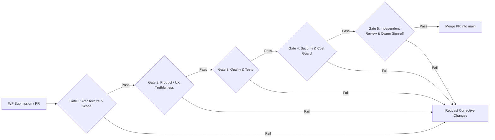

# Quality, Security, Cost & Product Release Gates

> **Canonical Document Location:** [`project-docs/40_DELIVERY/RELEASE_GATES.md`](project-docs/40_DELIVERY/RELEASE_GATES.md)

---

## 1. Release Gate Architecture

Prior to merging any Work Package or cutting a release tag, the submission MUST pass five sequential release gates.

---

## 2. Release Gate Checklist

### Gate 1: Architectural & Governance Compliance
- [ ] Changes stay strictly within the authorized WP/Issue contract.
- [ ] No unauthorized next-WP implementation is bundled into the PR.
- [ ] Provider abstraction remains intact; core domain/UI does not directly depend on provider SDK contracts.
- [ ] Cloud-first / LOCAL_AI-disallowed rule is preserved.
- [ ] Multi-project/history/version/lock requirements are not weakened.
- [ ] Documentation impacted by product/architecture changes is updated.

### Gate 2: Product / UX Truthfulness & Safety
- [ ] UI does not claim a capability is completed when backend behavior is placeholder/readiness only.
- [ ] Approval/QC status shown to users has truthful semantics.
- [ ] Costly actions are clearly differentiated from planning/review-only actions.
- [ ] Known cost/estimate is shown when reliable; unknown cost is shown as UNKNOWN, never fabricated.
- [ ] Important destructive or chargeable actions have appropriate confirmation/safeguards.
- [ ] Normal workflows preserve history; no silent loss from regeneration/editing.
- [ ] Guided Flexibility is maintained: clear next action, no dead-end states, understandable recovery guidance.

### Gate 3: Quality & Automated Test Pass
- [ ] Required unit/integration/backend regression tests pass at the exact reviewed HEAD.
- [ ] Frontend lint/typecheck/build/tests pass when frontend is changed.
- [ ] Provider adapter tests use mocks/fakes unless live UAT is explicitly authorized.
- [ ] Migration lifecycle tests pass when schema/migration changes exist.
- [ ] `git diff --check` passes.
- [ ] GitHub Actions for the exact reviewed HEAD are green.

### Gate 4: Security & Financial Guard
- [ ] Zero hardcoded API keys, secrets, passwords or provider tokens in code/docs/logs.
- [ ] External mutations preserve idempotency/job safety where applicable.
- [ ] Provider usage is auditable through the cost/usage ledger where chargeable work is involved.
- [ ] Budget hard-cap/soft-warning rules are preserved.
- [ ] Retry/resume logic does not duplicate chargeable completed work.
- [ ] CORS/auth/network exposure is appropriate for the deployment model and not widened casually.

### Gate 5: Independent Review & Human Sign-off
- [ ] ChatGPT independent review completed against exact current PR HEAD and active contract.
- [ ] Any material blockers are corrected and re-reviewed.
- [ ] Project Owner approval received for merge.
- [ ] Merge uses expected reviewed HEAD or re-review is required if HEAD changes.
- [ ] Post-merge repository truth is verified.

---

## 3. Current WP010 Gate

At the documented state, PR #25 / reviewed HEAD `291ea773681831a0a68e585eb7e0664902102be3` has **not** passed Gate 2 / Gate 4 due to product/history/safety issues identified in independent review. It remains **CHANGES REQUIRED** until a corrective HEAD is pushed and independently re-reviewed.

No merge is authorized by this document.
