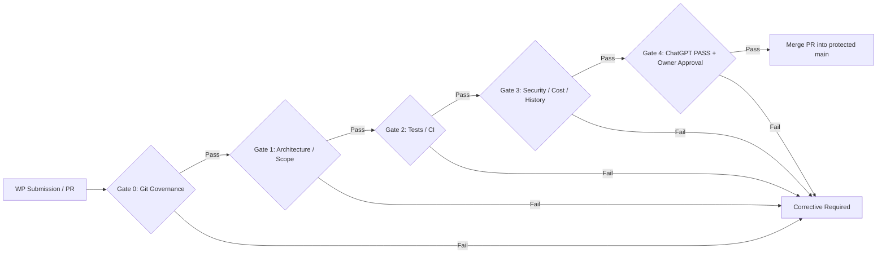

# Quality, Security & Cost Release Gates

> **Canonical Document Location:** [`project-docs/40_DELIVERY/RELEASE_GATES.md`](project-docs/40_DELIVERY/RELEASE_GATES.md)

---

## 1. Release Gate Architecture

Before merging any Work Package into `main`, all gates must pass.

---

## 2. Gate Checklist

### Gate 0 — Git Governance
- [ ] Work is on the authorized WP branch, not `main`.
- [ ] One WP = one branch = one PR.
- [ ] Corrective stayed in the same WP branch/PR unless Owner explicitly authorized otherwise.
- [ ] No force push / protected-branch bypass.
- [ ] Review conversations are resolved before merge.

### Gate 1 — Architectural & Scope Compliance
- [ ] Code/docs conform to locked architecture and current WP contract.
- [ ] No unauthorized future WP/features introduced.
- [ ] Provider-neutral boundaries are preserved.
- [ ] Canonical documentation is synchronized with repository truth.

### Gate 2 — Quality & Automated Tests
- [ ] Focused tests for changed behavior pass.
- [ ] Required final backend regression passes.
- [ ] Migration upgrade -> downgrade -> upgrade passes when schema changed.
- [ ] `git diff --check` is clean.
- [ ] Required GitHub `backend-tests` check passes.
- [ ] Frontend-changing PRs pass `frontend-tests` lint/build/tests when the workflow applies.
- [ ] No live paid provider testing unless explicitly authorized.

### Gate 3 — Security, Cost, History & Truthfulness
- [ ] No hardcoded secrets or unsafe provider payload persistence.
- [ ] Cost/idempotency/budget boundaries remain correct for chargeable actions.
- [ ] Locked entities cannot be bypassed.
- [ ] No silent destructive history loss.
- [ ] UI states, QC, cost, provider/config, progress and readiness claims reflect backend truth or explicitly say unknown/not checked.

### Gate 4 — Independent Review & Human Sign-off
- [ ] ChatGPT independent review is explicitly **PASS / READY TO MERGE** at the exact final HEAD.
- [ ] No unresolved blocking findings remain.
- [ ] Project Owner explicitly approves merge.

**Important:** Green CI alone is never sufficient to merge a PR that has not passed independent review at its exact current HEAD.
