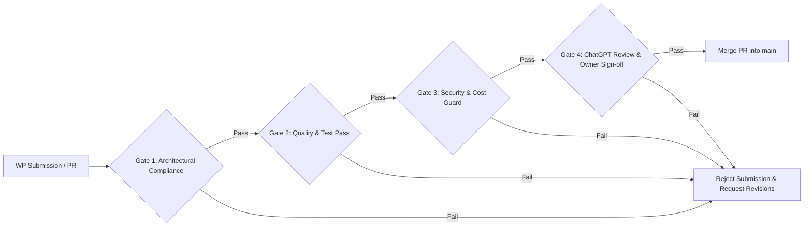

# Quality, Security & Cost Release Gates

> **Canonical Document Location:** [`project-docs/40_DELIVERY/RELEASE_GATES.md`](project-docs/40_DELIVERY/RELEASE_GATES.md)

---

## 1. Release Gate Architecture

Prior to merging any Work Package or cutting a release tag, the submission MUST pass four sequential release gates.

---

## 2. Release Gate Checklist Specs

### Gate 1: Architectural & Governance Compliance
- [ ] Code/docs strictly conform to locked architectural principles in [`project-docs/10_GOVERNANCE/SCOPE_LOCK.md`](project-docs/10_GOVERNANCE/SCOPE_LOCK.md).
- [ ] Zero workstation-specific absolute file paths (`file:///c:/...`) exist in documentation.
- [ ] No unauthorized out-of-scope features introduced.
- [ ] All new topics or schema modifications updated in canonical documentation files.

### Gate 2: Quality & Automated Test Pass
- [ ] 100% pass rate on unit test suite.
- [ ] 100% pass rate on provider adapter mock tests (zero live billing).
- [ ] Zero linting errors or build warnings.

### Gate 3: Security & Financial Guard
- [ ] Zero hardcoded API keys, secrets, or passwords in repository code or documentation.
- [ ] Idempotency key validation enforced on all new external integration endpoints.
- [ ] Cost audit logging verified for all provider API call sites.

### Gate 4: Independent Review & Human Sign-off
- [ ] ChatGPT Independent Review completed with recommendation to merge.
- [ ] Project Owner approval received and documented in PR discussion.
