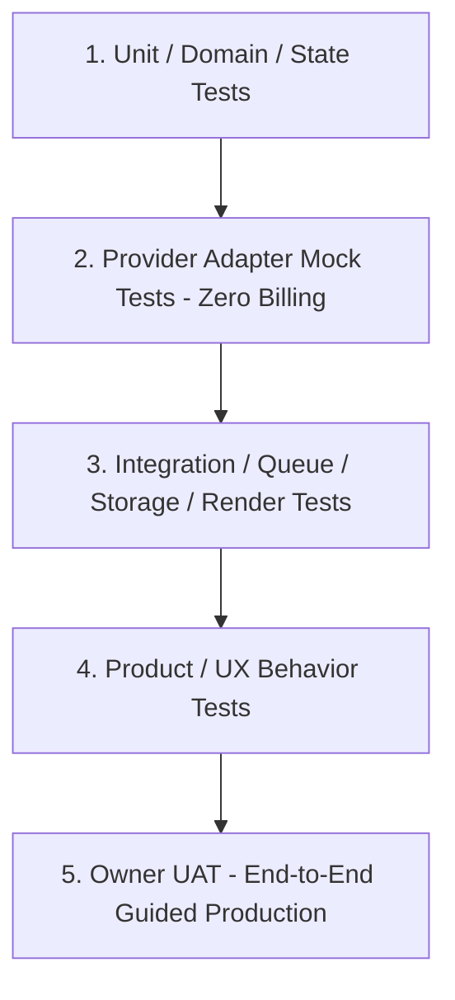

# Test & UAT Strategy

> **Canonical Document Location:** [`project-docs/40_DELIVERY/TEST_UAT_STRATEGY.md`](project-docs/40_DELIVERY/TEST_UAT_STRATEGY.md)

---

## 1. Multi-Layer Testing Model

To protect architecture, workflow correctness, cost safety and user experience, testing spans five layers:



---

## 2. Testing Layers & Methodology

### Layer 1 — Unit / Domain / State Tests

Scope includes:
- domain models and validation
- mode routing
- lock/state transitions
- approval-state rules
- version/history lineage behavior
- budget/cost calculations and idempotency
- retry/resume/reconciliation state
- audio planning/basic-mix rules where deterministic

Tests should be deterministic and avoid live provider calls.

### Layer 2 — Provider Adapter Mock Tests

Validate provider contract mapping without paid usage:

```text
CreativeProvider
ImageProvider
VideoProvider
AudioProvider
```

Mock tests should verify request mapping, references, provider errors, retries, secret safety and result normalization. Vidu remains the initial V1 video adapter target, but tests should reinforce provider independence rather than hard-code provider behavior into the domain.

### Layer 3 — Integration Tests

Scope includes:
- database migrations
- durable queue dispatch/claim/lease/retry/reconciliation
- object storage asset lifecycle
- project ownership/isolation
- history/version persistence
- cost ledger integration
- batch selected/incomplete job behavior
- render/assembly integration when those WPs are authorized

Use isolated test environments/containers and zero live billing unless a separate Owner-approved live UAT specifically requires it.

### Layer 4 — Product / UX Behavior Tests

Frontend tests should cover behavior, not just rendering components:

- multi-project dashboard filters/lifecycle actions
- STORY / SHORT / LOOP / SCENE mode-aware paths
- staged flow and approval gates
- Next Recommended Action logic
- Simple vs Advanced progressive disclosure
- empty/error/blocked state recovery
- truthful queue/QC/approval statuses
- cost warning/UNKNOWN behavior
- Generate Selected / Retry Failed / Continue Incomplete
- unsaved/autosave/reorder interactions as implemented
- no unsafe normal-path hard-delete behavior

Visual review should also check consistency, hierarchy, readability and whether first-time users can understand the next step.

### Layer 5 — Owner UAT

Core V1 UAT must validate a realistic end-to-end production journey:

```text
Create Project
-> Add Brief / References
-> Generate Story/Concept
-> Review / Approve
-> Generate Storyboard
-> Review / Approve
-> Generate Shot Plan
-> Review / Approve
-> Generate Images / Keyframes as applicable
-> Generate Video Shots
-> Produce VO / BGM / SFX / Ambience
-> Auto Assemble / Preview
-> QC
-> Final Approval
-> Render
-> Export Variants
```

UAT must verify the user can pause and review before expensive generation, recover from partial failure without restarting completed work and reopen historical project state.

---

## 3. Current WP010 Verification Requirement

For the corrective on PR #25, required evidence should include at least:

- backend full regression tests if backend changes exist
- frontend tests
- frontend lint
- frontend build/typecheck
- `git diff --check`
- exact-head GitHub Actions green
- no live paid provider calls
- screenshots or direct UI evidence sufficient to review Guided Flexibility / staged workflow truthfulness

ChatGPT independent review compares the exact corrective HEAD against Issue #24 and all authorized addenda. CI green alone does not close product/UX blockers.
