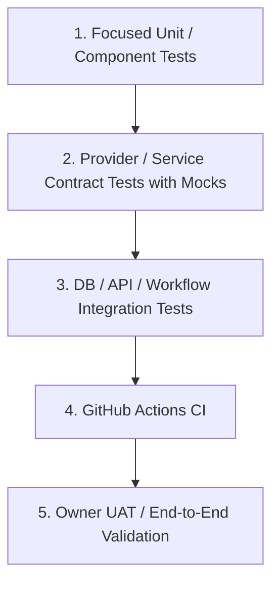

# Test & UAT Strategy

> **Canonical Document Location:** [`project-docs/40_DELIVERY/TEST_UAT_STRATEGY.md`](project-docs/40_DELIVERY/TEST_UAT_STRATEGY.md)

---

## 1. Testing Layers

Orbis testing is designed to preserve architecture, provider safety, cost safety, UI truthfulness and release quality without wasting paid AI/provider credits.

---

## 2. Current Tooling

### Backend
- Python / `pytest`.
- Provider calls mocked unless a WP explicitly authorizes paid/live UAT.
- Migration lifecycle validation when schema changes.
- GitHub workflow: `.github/workflows/backend-tests.yml`.
- Repository ruleset requires `backend-tests` before merge.

### Frontend
- Frontend lint, build/typecheck and test suite.
- GitHub workflow: `.github/workflows/frontend-tests.yml` introduced by WP010.
- Frontend-changing PRs must keep this check green even if it is not the repository's only required ruleset check.

---

## 3. Low-Credit Test Policy

During implementation/corrective loops:
- run only focused tests directly relevant to changed code
- do not rerun the full backend/frontend suite after every small edit
- do not use live paid provider calls merely to create evidence

At the final gate:
- run the complete required backend regression once
- run frontend lint/build/tests once for frontend changes
- run migration upgrade -> downgrade -> upgrade once when schema changed
- run environment-specific validation only when the WP requires it
- run `git diff --check`
- verify GitHub Actions at the exact final HEAD

---

## 4. Provider / Cost Safety

- Provider adapter behavior is validated primarily through mocks and contract fixtures.
- Idempotency, retry/reconciliation, cancellation, budget and usage-ledger tests must prevent duplicate/unsafe charge behavior.
- Unknown cost must remain UNKNOWN; tests must never require fabricated pricing.
- No secret, token or unsafe raw provider payload may appear in persisted/logged test evidence.

---

## 5. UI / Workspace Correctness Testing

Frontend tests should cover, as applicable:
- video-mode routing
- multi-project management
- staged Story / Storyboard / Shot Plan review flow
- lock safety
- reference/document upload and effective references
- queue/cancel/reconciliation states
- budget and cost warnings
- truthful progress/QC/readiness states
- Generate Selected / batch safety
- archive/history retention behavior
- keyboard/focus/accessibility basics

A visually green component is not enough if it presents fabricated or backend-unverified state.

---

## 6. UAT

Owner UAT occurs only after automated validation and ChatGPT independent review reach a reviewable/PASS gate.

UAT validates real user flow and safety, including:
- first-time project creation
- correct STORY / SHORT / LOOP / SCENE routing
- review-before-costly-generation behavior
- lock/history/budget safety
- understandable failure/reconciliation recovery
- no silent data loss

Production/live paid provider UAT requires separate explicit authorization when it would incur credits or external side effects.
