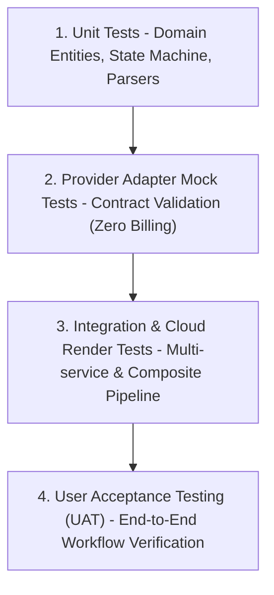

# Test & UAT Strategy

> **Canonical Document Location:** [`project-docs/40_DELIVERY/TEST_UAT_STRATEGY.md`](project-docs/40_DELIVERY/TEST_UAT_STRATEGY.md)

---

## 1. Multi-Tiered Testing Pyramid

To ensure architectural integrity, provider stability, cost efficiency, and rendering quality, testing spans four distinct layers:

---

## 2. Testing Layers & Methodology

### 1. Unit Testing
- **Scope:** Domain models, state transition machines, document parsers, audio ducking calculations.
- **Framework:** Test runner / assertion library *(Candidate TBD)*.
- **Rule:** 100% pure in-memory execution; no network or database calls.

### 2. Provider Adapter Mock Testing
- **Scope:** Validates `IVideoGenerationProviderAdapter` implementations against mock Vidu API responses.
- **Objective:** Verifies prompt formatting, reference image mapping, seed retention, retry handling, and error response handling **WITHOUT incurring live provider billing charges**.

### 3. Integration & Cloud Render Testing
- **Scope:** Tests queue dispatching, object storage asset uploading, relational state mutations, and cloud video compositing.
- **Environment:** Containerized integration test suite running in isolated container environment.

### 4. User Acceptance Testing (UAT)
- **Scope:** Validates end-to-end user story workflows from browser UI workspace to final MP4 download.
- **Protocol:** Executed against human approval gates, asset lock mechanisms, and multi-output export profiles. Requires Project Owner sign-off.
