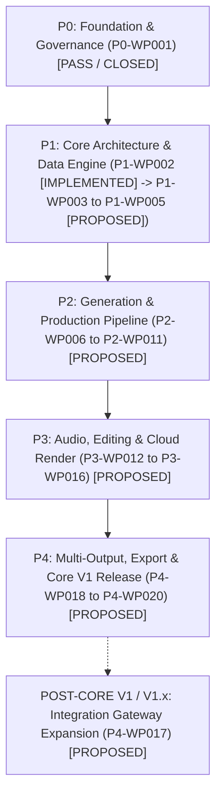

# Work Package Roadmap

> **Canonical Document Location:** [`project-docs/40_DELIVERY/WORK_PACKAGES.md`](project-docs/40_DELIVERY/WORK_PACKAGES.md)

---

## 1. Roadmap Overview

The delivery of Orbis Video Studio AI is structured into discrete, sequential **Work Packages (WPs)**. Each Work Package defines a self-contained scope, strict deliverables, acceptance criteria, and stop conditions.

> [!IMPORTANT]
> **PROPOSAL STATUS NOTICE**
> 
> Work Packages beyond **P1-WP002** are PROPOSED roadmap items. Technology selections and frameworks listed in proposed WPs are **candidate tech stacks (TBD)** and MUST be formally authorized by the Project Owner prior to execution.

---

## 2. Work Package Master Breakdown

---

## 3. Work Package Registry

### Phase 0 — Foundation & Governance
- **`P0-WP001` — Project Governance & Architecture Documentation Foundation**
  - **Status:** **PASS / CLOSED** *(Merged into `main` via PR #1 at commit `4eddc44f0733f6d8e6e9772090183b3b3f4c3194`)*
  - **Scope:** Establish canonical governance, system architecture, product specs, and delivery docs. Zero application code.

### Phase 1 — Core Architecture & Data Engine
- **`P1-WP002` — Backend Core Framework & Domain Database Setup**
  - **Status:** **IMPLEMENTED / WAITING CHATGPT REVIEW**
  - **Scope:** FastAPI application bootstrap, PostgreSQL configuration, SQLAlchemy 2.x ORM models, Alembic migrations, Docker Compose environment, unit tests.
- **`P1-WP003` — S3 Object Storage & Asset Management API**
  - **Status:** **PROPOSED / NOT AUTHORIZED**
  - **Scope:** S3-compatible storage adapter, file upload pipeline, media asset metadata service.
- **`P1-WP004` — Document Ingestion & Text Extraction Engine**
  - **Status:** **PROPOSED / NOT AUTHORIZED**
  - **Scope:** Implement PDF, Word (.docx), PowerPoint (.pptx), and brief text parsers.
- **`P1-WP005` — Story & Screenplay Script Generator Service**
  - **Status:** **PROPOSED / NOT AUTHORIZED**
  - **Scope:** Story outline generator, screenplay formatter, scene/shot parser.

### Phase 2 — AI Generation & Production Pipeline
- **`P2-WP006` — Reference Library & Character/Location Bibles**
  - **Status:** **PROPOSED / NOT AUTHORIZED**
  - **Scope:** Reference asset CRUD service, visual similarity tagging, prompt reference injector.
- **`P2-WP007` — Vidu Provider Adapter & Job Dispatch Queue**
  - **Status:** **PROPOSED / NOT AUTHORIZED**
  - **Scope:** Implement `IVideoGenerationProviderAdapter` for Vidu (V1 default), durable async worker queue, retry handler.
- **`P2-WP008` — Hybrid Shot Engine & Asset Lock Machine**
  - **Status:** **PROPOSED / NOT AUTHORIZED**
  - **Scope:** Hybrid shot import (video, image, recorded, stock), granular entity locking state machine.
- **`P2-WP009` — Cost Control & Granular Usage Audit Ledger**
  - **Status:** **PROPOSED / NOT AUTHORIZED**
  - **Scope:** Budget cap guards, provider job usage logging, cost audit API needed for generation safety.
- **`P2-WP010` — Web Workspace UI: Storyboard & Shot Grid**
  - **Status:** **PROPOSED / NOT AUTHORIZED**
  - **Scope:** Browser UI workspace for project creation, document upload, script editor, and shot grid. *(Tech choice: TBD)*
- **`P2-WP011` — Selective Shot Regeneration Service**
  - **Status:** **PROPOSED / NOT AUTHORIZED**
  - **Scope:** Target shot selection, lock validation guard, selective provider dispatch.

### Phase 3 — Audio, Timeline Editing & Cloud Rendering
- **`P3-WP012` — Audio Production & Voice Over / TTS Service**
  - **Status:** **PROPOSED / NOT AUTHORIZED**
  - **Scope:** Multi-stem audio track manager, TTS dubbing integration, SFX/BGM assignment.
- **`P3-WP013` — Subtitle Generator & Auto-Ducking Processor**
  - **Status:** **PROPOSED / NOT AUTHORIZED**
  - **Scope:** SRT/VTT auto-generation, sidechain audio ducking algorithm implementation.
- **`P3-WP014` — Simplified Multi-Track Timeline Preview Engine**
  - **Status:** **PROPOSED / NOT AUTHORIZED**
  - **Scope:** Browser timeline UI, shot trimming, track syncing, real-time preview player.
- **`P3-WP015` — Cloud FFmpeg Video Render Workers**
  - **Status:** **PROPOSED / NOT AUTHORIZED**
  - **Scope:** Scalable cloud render worker pool, FFmpeg multi-track compositing, watermark overlay.
- **`P3-WP016` — Human Approval Gates & QC Review Pipeline**
  - **Status:** **PROPOSED / NOT AUTHORIZED**
  - **Scope:** Cost threshold approval gates, preview watermark player, human sign-off state machine.

### Phase 4 — Multi-Output, Export & Core V1 Release
- **`P4-WP018` — Multi-Output & Platform Export Presets**
  - **Status:** **PROPOSED / NOT AUTHORIZED**
  - **Scope:** Presets for 16:9, 9:16, 1:1, smart subject cropping, subtitle burning profiles.
- **`P4-WP019` — Project Export/Import Archive Package (.orbis)**
  - **Status:** **PROPOSED / NOT AUTHORIZED**
  - **Scope:** ZIP package exporter/importer, metadata validation, disaster recovery scripts.
- **`P4-WP020` — End-to-End System Integration, UAT & Core V1 Release**
  - **Status:** **PROPOSED / NOT AUTHORIZED**
  - **Scope:** Complete Core V1 PASS checklist validation, end-to-end UAT sign-off, production release tag.

### Post-Core V1 / V1.x — Integration Expansion
- **`P4-WP017` — Full Operational Integration Gateway (Hermes / n8n)**
  - **Status:** **PROPOSED / POST-CORE V1 / V1.x**
  - **Scope:** Full operational integration gateway connectors, external agent automation hooks, webhook dispatchers. Architecture readiness (REST boundaries, auth, permissions, audit, idempotency) is maintained in V1.
