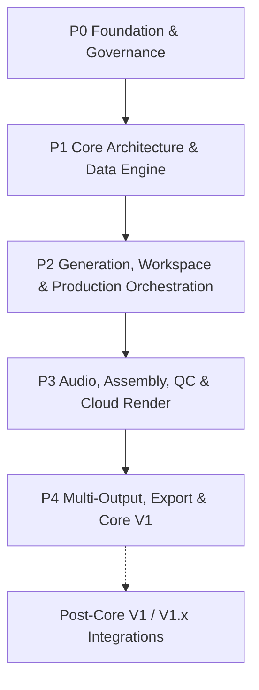

# Work Package Roadmap

> **Canonical Document Location:** [`project-docs/40_DELIVERY/WORK_PACKAGES.md`](project-docs/40_DELIVERY/WORK_PACKAGES.md)

---

## 1. Roadmap Overview

Orbis Video Studio AI is delivered through discrete, bounded Work Packages. Every WP and every paid/live sub-gate requires explicit Owner authorization. Completion of one gate never auto-authorizes the next.



---

## 2. Current Delivery Summary

```text
Completed Core V1 WPs: 19 / 20
WP-count completion: 95%
ACTIVE_WORK_PACKAGE: P4-WP020-LIVE-R4-TOOL1
P4-WP020: ACTIVE / NOT CLOSED
R4 PRE1: PASS / COMPLETED / CLOSED
R4 TOOL1: OWNER AUTHORIZED / NO-PAID IMPLEMENTATION + CI REVIEW
Core V1 release: NOT DECLARED
R4 paid/live execution: NOT AUTHORIZED
```

Tooling baseline:

```text
main at R4 TOOL1 start: de17a125dcd3b8066a546369d03aba813a7b5641
branch: ai/p4-wp020-live-r4-tool1
R4 execution identity: LIVE-20260909-DE17-R4
TOOL1 provider generation calls: 0
TOOL1 spend authorization: USD 0.00
```

---

## 3. Completed Work Packages

| WP | Title | Status |
| :--- | :--- | :--- |
| P0-WP001 | Project Governance & Architecture Documentation Foundation | PASS / CLOSED / MERGED |
| P1-WP002 | Backend Core Framework & Domain Database Setup | PASS / CLOSED / MERGED |
| P1-WP003 | S3 Object Storage & Asset Management API | PASS / CLOSED / MERGED |
| P1-WP004 | Document Ingestion & Text Extraction Engine | PASS / CLOSED / MERGED |
| P1-WP005 | Story & Screenplay Script Generator Service | PASS / CLOSED / MERGED |
| P2-WP006 | Reference Library & Character/Location Bibles | PASS / CLOSED / MERGED |
| P2-WP007 | Vidu Provider Adapter & Durable Job Dispatch Queue | PASS / CLOSED / MERGED |
| P2-WP008 | Hybrid Shot Engine, Asset Lock Machine & Base Video Modes | PASS / CLOSED / MERGED |
| P2-WP009 | Cost Control & Granular Usage Audit Ledger | PASS / CLOSED / MERGED |
| P2-WP010 | Mode-Aware Web Workspace & Automation-First Storyboard UX | PASS / CLOSED / MERGED |
| P2-WP011 | Selective / Batch Regeneration & Resume + Performance Guardrails | PASS / CLOSED / MERGED |
| P2-WP012 | Production Orchestrator & Staged Approval State Machine | PASS / CLOSED / MERGED |
| P2-WP013 | Provider-Neutral Storyboard Image / Keyframe Pipeline | PASS / CLOSED / MERGED |
| P3-WP014 | Core V1 Audio Production Automation | PASS / CLOSED / MERGED |
| P3-WP015 | Simplified Assembly / Timeline Preview | PASS / CLOSED / MERGED |
| P3-WP016 | Core V1 QC & Approval Pipeline | PASS / CLOSED / MERGED |
| P3-WP017 | Cloud Render Workers | PASS / CLOSED / MERGED |
| P4-WP018 | Multi-Output & Platform Export Presets | PASS / CLOSED / MERGED |
| P4-WP019 | Project Export/Import Archive Package (`.orbis`) | PASS / CLOSED / MERGED |

---

## 4. Remaining Core V1 Roadmap

### P4-WP020 — End-to-End System Integration, UAT & Core V1 Release

```text
Status: ACTIVE / NOT CLOSED
Current sub-gate: P4-WP020-LIVE-R4-TOOL1
Current sub-gate type: NO-PAID TOOLING PREPARATION
Last completed sub-gate: R4-PRE1-CLOSE PASS / MERGED / COMPLETE
Paid LIVE execution: NOT AUTHORIZED
Core V1 release declaration: NOT AUTHORIZED
```

Purpose remains to verify the already-delivered Core V1 system end to end, collect bounded provider and downstream evidence, close only proven release-blocking defects inside authorized WP020 contracts, and stop for the final Owner release decision.

### Immutable LIVE history

R1:
- consumed / immutable;
- bounded OpenAI request returned HTTP 429;
- never rerun.

R2:
- `LIVE-20260909-BB75-R2` / run `34287696335`;
- fence consumed;
- OpenAI STORY succeeded;
- Gemini IMAGE stopped on non-success `HTTP_ERROR`;
- exact historical Gemini HTTP status unavailable;
- conservative calls = 2/6;
- last known confirmed/committed UAT cost = USD 0.0072;
- Vidu / ElevenLabs / downstream not executed;
- never rerun.

R2-C1:
- PR #74 PASS / MERGED / CLOSED;
- future Gemini non-2xx job evidence retains sanitized HTTP status/classification;
- provider calls = 0; spend = USD 0.00.

R3:
- execution `LIVE-20260909-363F-R3` / run `34297314995`;
- exact execution main `82ce42116e3f866227dd598814cf79c0b9c640c4`;
- fence consumed;
- OpenAI STORY succeeded;
- Gemini IMAGE returned HTTP 429 / retryable true / submission_uncertain false;
- conservative calls = 2/6;
- known committed/actual Orbis UAT cost at STOP = USD 0.0065;
- Vidu / ElevenLabs / downstream not executed;
- never rerun.

R3-C1 / C1-CLOSE:
- PR #78 corrective merged;
- PR #79 closure sync merged;
- provider calls from corrective/closure = 0; spend = USD 0.00.

R4-PRE1:
- full runtime no-paid preflight run `34302711166` = SUCCESS;
- Gemini metadata-only access probe run `34302730786` = SUCCESS / HTTP 200 / `ACCESS_PROBE_PASS`;
- both runs on exact main `170e82d19315e80cc7393922d7daa1b1c7f2093b`;
- generation calls = 0; spend = USD 0.00; fence = false.

R4-PRE1-CLOSE:
- PR #81 merged;
- canonical main advanced to `de17a125dcd3b8066a546369d03aba813a7b5641`;
- status PASS / MERGED / COMPLETE.

### R4-TOOL1 — Active / NO-PAID

Owner authorized `P4-WP020-LIVE-R4-TOOL1 — Bounded One-Shot Execution Tooling Preparation`.

Authorized tooling includes:
- exact R4 identity/SHA/fence/call/budget guards;
- manual-only R4 no-paid preflight;
- manual-only one-shot R4 paid workflow that remains inert without later exact Owner authorization;
- fail-closed R4 runner adapter reusing only the exact reviewed R3 implementation blob;
- durable sanitized failure evidence before ephemeral runtime teardown;
- regression/static tests and control-doc sync.

Locked future paid chain:

```text
OpenAI STORY x1
Gemini IMAGE x1
Vidu VIDEO x1
ElevenLabs AUDIO x3
Maximum chargeable requests: 6
Hard cap: USD 1.00
Sequential only
OpenAI retries: 0
Execution ID: LIVE-20260909-DE17-R4
Tooling base main: de17a125dcd3b8066a546369d03aba813a7b5641
```

The R4 adapter requires the inherited R3 runner Git blob SHA `24150cdece623004443e03ceecea10490955822b` and fails closed if it drifts. No dynamic source rewrite is permitted.

TOOL1 itself authorizes **zero provider generation calls and USD 0.00 spend**.

Detailed TOOL1 contract: `P4_WP020_LIVE_R4_TOOL1.md`.

---

## 5. Required Gates After R4 TOOL1

```text
R4 TOOL1 implementation
-> exact-head backend/frontend/migration CI
-> independent review
-> Owner merge approval
-> fresh R4 PF1 no-paid preflight on exact post-merge main
-> fresh exact-SHA Owner R4 paid authorization marker
-> separate explicit Owner RUN authorization
-> R4 LIVE paid workflow
```

No step auto-authorizes the next one. A STOP after R4 fence consumption permanently consumes `LIVE-20260909-DE17-R4`.

---

## 6. Post-Core V1 / V1.x — Not Part of WP020 by Default

Unless separately authorized, WP020 does not include new production modes, new provider implementations, cloud ComfyUI implementation, social publishing automation, marketplace/provider ecosystem work, heavyweight NLE/DAW capability, or realtime cloud project replication/sync.

---

## 7. Product Locks

```text
MULTI_PROJECT = REQUIRED
FULL_HISTORY_RETENTION = REQUIRED
AUDITABLE_CHANGES = REQUIRED
NO_SILENT_HISTORY_LOSS = REQUIRED
AUTOMATION_FIRST = REQUIRED
APPROVAL_GATED_AUTOMATION = REQUIRED
GUIDED_FLEXIBILITY = REQUIRED
AUDIO_PRODUCTION_CORE_V1 = REQUIRED
PROVIDER_INDEPENDENCE = REQUIRED
PERFORMANCE_AND_SCALABILITY = REQUIRED_PRODUCT_QUALITY_ATTRIBUTE
LOCAL_AI = DISALLOWED
CLOUD_AI = REQUIRED
VENDOR_LOCK_IN = DISALLOWED
```

Core V1 modes: `STORY / SHORT / LOOP / SCENE`.
Future architecture-only modes: `PRODUCT / EXPLAINER / PRESENTER / MONTAGE`.

---

## 8. Execution Rule

While R4 TOOL1 is active:

- do not dispatch R4 workflows;
- do not write R4 paid authorization/fence markers;
- do not call providers;
- do not release/tag/deploy;
- stop at the Owner merge gate after exact-head CI and independent review.
