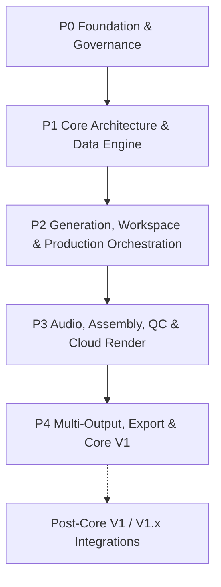

# Work Package Roadmap

> **Canonical Document Location:** [`project-docs/40_DELIVERY/WORK_PACKAGES.md`](project-docs/40_DELIVERY/WORK_PACKAGES.md)

---

## 1. Roadmap Overview

Orbis Video Studio AI is delivered through discrete, bounded Work Packages. Every WP requires explicit Owner authorization before implementation. Completion of one WP never auto-authorizes the next.

The product direction is automation-first: Orbis orchestrates external Creative, Image, Video and Audio AI services behind adapters while owning production state, approvals, history, cost control, QC, assembly, render, export and project portability.



---

## 2. Current Delivery Summary

```text
Completed Core V1 WPs: 19 / 20
WP-count completion: 95%
ACTIVE_WORK_PACKAGE: NONE
P4-WP020: PROPOSED / NOT AUTHORIZED
```

Canonical main truth after WP019:

```text
main HEAD: a09fcab835515679bf4f0bbfce8aec84f7e15062
P4-WP019 PR #50: MERGED / CLOSED
P4-WP019 final reviewed HEAD: df691035f54c1a9ffea4934b6f43134fde35d391
P4-WP019 final review: PASS / READY FOR OWNER MERGE DECISION
P4-WP019 final review ID: 5135969695
P4-WP019 merge commit: a09fcab835515679bf4f0bbfce8aec84f7e15062
```

---

## 3. Completed Work Packages

| WP | Title | Status |
| :--- | :--- | :--- |
| P0-WP001 | Project Governance & Architecture Documentation Foundation | PASS / CLOSED / MERGED |
| P1-WP002 | Backend Core Framework & Domain Database Setup | PASS / CLOSED / MERGED |
| P1-WP003 | S3 Object Storage & Asset Management API | PASS / CLOSED / MERGED |
| P1-WP004 | Document Ingestion & Text Extraction Engine | PASS / CLOSED / MERGED |
| P1-WP005 | Story & Screenplay Script Generator Service | PASS / CLOSED / MERGED |
| P2-WP006 | Reference Library & Character/Location Bibles | PASS / CLOSED / MERGED |
| P2-WP007 | Vidu Provider Adapter & Durable Job Dispatch Queue | PASS / CLOSED / MERGED |
| P2-WP008 | Hybrid Shot Engine, Asset Lock Machine & Base Video Modes | PASS / CLOSED / MERGED |
| P2-WP009 | Cost Control & Granular Usage Audit Ledger | PASS / CLOSED / MERGED |
| P2-WP010 | Mode-Aware Web Workspace & Automation-First Storyboard UX | PASS / CLOSED / MERGED |
| P2-WP011 | Selective / Batch Regeneration & Resume + Performance Guardrails | PASS / CLOSED / MERGED |
| P2-WP012 | Production Orchestrator & Staged Approval State Machine | PASS / CLOSED / MERGED |
| P2-WP013 | Provider-Neutral Storyboard Image / Keyframe Pipeline | PASS / CLOSED / MERGED |
| P3-WP014 | Core V1 Audio Production Automation | PASS / CLOSED / MERGED |
| P3-WP015 | Simplified Assembly / Timeline Preview | PASS / CLOSED / MERGED |
| P3-WP016 | Core V1 QC & Approval Pipeline | PASS / CLOSED / MERGED |
| P3-WP017 | Cloud Render Workers | PASS / CLOSED / MERGED |
| P4-WP018 | Multi-Output & Platform Export Presets | PASS / CLOSED / MERGED |
| P4-WP019 | Project Export/Import Archive Package (`.orbis`) | PASS / CLOSED / MERGED |

Key recent merge truth:

```text
P3-WP017 PR #44 merge: 72065b9c29350e54dd7811a00d7198c6765004d1
P4-WP018 PR #47 merge: 09e62876543ee7990919beb43600a1c748be545d
P4-WP019 PRE1 PR #49 merge: 5f3ccbbcd0ee528bb85501a32efb64c5b13fbce5
P4-WP019 implementation PR #50 merge: a09fcab835515679bf4f0bbfce8aec84f7e15062
```

---

## 4. P4-WP019 Closure Detail

### P4-WP019 — Project Export/Import Archive Package (`.orbis`)

```text
Status: PASS / CLOSED / MERGED
PR: #50
Branch: ai/p4-wp019-orbis-archive
Final reviewed HEAD: df691035f54c1a9ffea4934b6f43134fde35d391
Final Review ID: 5135969695
Merge Commit: a09fcab835515679bf4f0bbfce8aec84f7e15062
Proposal: project-docs/40_DELIVERY/P4_WP019_PROPOSAL.md
```

Accepted scope delivered:

- `.orbis` ZIP-compatible archive format.
- canonical manifest/checksum trust root and canonical JSON.
- secure path validation and archive size/count/compression guards.
- Core V1 `FULL_SELF_CONTAINED` export contract.
- full project graph serialization.
- CLONE mode with fresh UUID/FK remap and source lineage.
- RESTORE mode with fail-closed collision handling.
- Phase-3 graph/referential-integrity preflight.
- asset completeness and payload/catalog/database size consistency.
- historical RenderJob/GenerationJob preservation and worker fencing.
- historical UsageLedger preservation, partial-index fencing and budget exclusion.
- transaction rollback and storage compensation.
- REST API export/import endpoints.
- frontend Export/Import UX.

Final exact-head verification before merge:

```text
Backend: 412 passed, 2 skipped
Frontend: 52/52 tests PASS
Frontend build/typecheck: PASS
Frontend lint: 0 errors
```

P4-WP019 must not be reopened unless a proven regression is found.

---

## 5. Remaining Core V1 Roadmap

### P4-WP020 — End-to-End System Integration, UAT & Core V1 Release

```text
Status: PROPOSED / NOT AUTHORIZED
Implementation authorization: NONE
```

Purpose:

- verify the already-delivered Core V1 system end to end;
- execute bounded UAT across the supported Core V1 modes and critical production path;
- verify failure/recovery, cost, history, approval, render/export and archive behavior at system level;
- close release-blocking defects only within the authorized WP020 contract;
- collect release evidence and make the final Core V1 release decision.

Before any implementation, ChatGPT must inspect repository truth and present a bounded WP020 contract containing at minimum:

1. exact scope and explicit exclusions;
2. E2E scenario matrix;
3. UAT scenario matrix;
4. critical regression gates;
5. release-blocking severity rules;
6. test/evidence requirements;
7. rollback/recovery requirements;
8. Core V1 release closure criteria.

Owner authorization is mandatory before WP020 implementation starts.

---

## 6. Post-Core V1 / V1.x — Not Part of WP020 by Default

The following remain future work unless separately authorized:

- full Hermes / n8n / external-agent operational gateway;
- new production modes beyond STORY / SHORT / LOOP / SCENE;
- new provider implementations beyond currently accepted Core V1 boundaries;
- cloud-hosted ComfyUI provider implementation;
- social publishing automation;
- marketplace/provider ecosystem;
- heavyweight NLE/DAW capabilities;
- realtime cloud project replication/sync.

ComfyUI + Cloud GPU remains a future provider/execution candidate only:

```text
Orbis
-> GenerationJob
-> Provider Adapter
-> ComfyUI Provider
-> Cloud GPU Worker
-> Object Storage
-> Orbis Asset / Version / History
```

Status: `PROPOSED / NOT AUTHORIZED / NOT IMPLEMENTED`

---

## 7. Product Locks Governing Future WPs

```text
MULTI_PROJECT = REQUIRED
FULL_HISTORY_RETENTION = REQUIRED
AUDITABLE_CHANGES = REQUIRED
NO_SILENT_HISTORY_LOSS = REQUIRED
AUTOMATION_FIRST = REQUIRED
HUMAN_REVIEW_NOT_HUMAN_MICROMANAGEMENT = REQUIRED
APPROVAL_GATED_AUTOMATION = REQUIRED
GUIDED_FLEXIBILITY = REQUIRED
AUDIO_PRODUCTION_CORE_V1 = REQUIRED
PROVIDER_INDEPENDENCE = REQUIRED
PERFORMANCE_AND_SCALABILITY = REQUIRED_PRODUCT_QUALITY_ATTRIBUTE
LOCAL_AI = DISALLOWED
CLOUD_AI = REQUIRED
VENDOR_LOCK_IN = DISALLOWED
```

Core V1 modes:

```text
STORY
SHORT
LOOP
SCENE
```

Architecture-ready later only:

```text
PRODUCT
EXPLAINER
PRESENTER
MONTAGE
```

Future-mode readiness must not silently expand an active WP.

---

## 8. Execution Rule

```text
ACTIVE_WORK_PACKAGE = NONE
```

No application-code implementation may start until the Owner explicitly authorizes P4-WP020 or another bounded work package.
