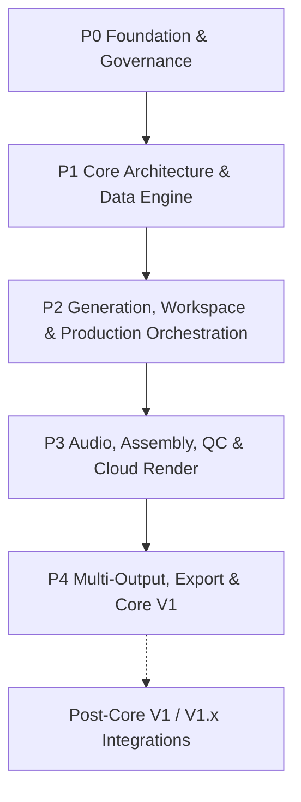

# Work Package Roadmap

> **Canonical Document Location:** [`project-docs/40_DELIVERY/WORK_PACKAGES.md`](project-docs/40_DELIVERY/WORK_PACKAGES.md)

---

## 1. Roadmap Overview

Orbis Video Studio AI is delivered through discrete, bounded Work Packages. Every WP and every paid/live sub-gate requires explicit Owner authorization. Completion of one gate never auto-authorizes the next.



---

## 2. Current Delivery Summary

```text
Completed Core V1 WPs: 19 / 20
WP-count completion: 95%
P4-WP020: ACTIVE / NOT CLOSED
P4-WP020-LIVE-R5-PRE1: PASS / COMPLETED / NO-PAID (RUN 34351326791)
P4-WP020-LIVE-R5-PRE1-CLOSE: PASS / MERGED / COMPLETE
P4-WP020-LIVE-R5-PRE1-CLOSE-R1: PASS / MERGED / COMPLETE
P4-WP020-LIVE-R5-VIDU1-PREP: PASS / MERGED / COMPLETE (PR #92)
P4-WP020-LIVE-R5-VIDU1-COR1: PASS / MERGED / COMPLETE (PR #93)
P4-WP020-LIVE-R5-VIDU1-C1: PASS / MERGED / COMPLETE (PR #94)
P4-WP020-LIVE-R5-VIDU1-C1-CLOSE: PASS / MERGED / COMPLETE (PR #95)
P4-WP020-LIVE-R5-VIDU2-PREP: IN_PROGRESS / PR_OPEN / NO-PAID
ACTIVE_WORK_PACKAGE: P4-WP020-LIVE-R5-VIDU2-PREP
CURRENT_GATE: P4-WP020-LIVE-R5-VIDU2-PREP
NEXT_GATE: CHATGPT_REVIEW_AND_OWNER_MERGE_DECISION
Core V1 release: NOT DECLARED
R5 or later paid/live execution: NONE / NOT AUTHORIZED
```

Current baseline:

```text
canonical base main: 5107e3e9ef7702c8403fe74146062ab68e8e50b9
VIDU1 readiness identity: WP020-LIVE-R5-VIDU1-PREP
VIDU1 paid identity: NONE / NOT AUTHORIZED
VIDU1 paid execution: NOT AUTHORIZED
VIDU1 provider generation calls: 0
VIDU1 paid provider calls: 0
VIDU1 generation posts: 0
VIDU1 credits consumed: 0
VIDU1 paid fence written: false
VIDU1 paid live dispatch: false
R5 readiness identity: WP020-LIVE-R5-PRE1
R5 preflight run: 34351326791
R5 preflight status: PASS / COMPLETED / NO-PAID
R5 paid identity: NONE / NOT AUTHORIZED
R5 paid execution: NOT AUTHORIZED
R5 provider generation calls: 0
R5 paid provider calls: 0
R5 Vidu credits consumed: 0
R5 paid fence written: false
R5 paid live dispatch: false
R4 execution identity: LIVE-20260909-DE17-R4
R4 run: 34316188814
R4 fence: CONSUMED / NEVER RERUN
R4 STOP phase: LIVE-03-VIDU-VIDEO
R4 conservative calls: 3 / 6
R4 last known committed/actual Orbis UAT cost: USD 0.0738
R4 Vidu internal job estimate: USD 0.15 / ESTIMATED
R4 failed Vidu external billing: NOT CHARGED / PROVIDER-SIDE EVIDENCE ACCEPTED
BILL1 authorization comment: 5598882289
BILL1 disposition comment: 5598962073
Vidu balance readiness evidence: 2,000 credits / Owner-provided screenshot / not USD billing evidence
```

---

## 3. Completed Work Packages

| WP | Title | Status |
| :--- | :--- | :--- |
| P0-WP001 | Project Governance & Architecture Documentation Foundation | PASS / CLOSED / MERGED |
| P1-WP002 | Backend Core Framework & Domain Database Setup | PASS / CLOSED / MERGED |
| P1-WP003 | S3 Object Storage & Asset Management API | PASS / CLOSED / MERGED |
| P1-WP004 | Document Ingestion & Text Extraction Engine | PASS / CLOSED / MERGED |
| P1-WP005 | Story & Screenplay Script Generator Service | PASS / CLOSED / MERGED |
| P2-WP006 | Reference Library & Character/Location Bibles | PASS / CLOSED / MERGED |
| P2-WP007 | Vidu Provider Adapter & Durable Job Dispatch Queue | PASS / CLOSED / MERGED |
| P2-WP008 | Hybrid Shot Engine, Asset Lock Machine & Base Video Modes | PASS / CLOSED / MERGED |
| P2-WP009 | Cost Control & Granular Usage Audit Ledger | PASS / CLOSED / MERGED |
| P2-WP010 | Mode-Aware Web Workspace & Automation-First Storyboard UX | PASS / CLOSED / MERGED |
| P2-WP011 | Selective / Batch Regeneration & Resume + Performance Guardrails | PASS / CLOSED / MERGED |
| P2-WP012 | Production Orchestrator & Staged Approval State Machine | PASS / CLOSED / MERGED |
| P2-WP013 | Provider-Neutral Storyboard Image / Keyframe Pipeline | PASS / CLOSED / MERGED |
| P3-WP014 | Core V1 Audio Production Automation | PASS / CLOSED / MERGED |
| P3-WP015 | Simplified Assembly / Timeline Preview | PASS / CLOSED / MERGED |
| P3-WP016 | Core V1 QC & Approval Pipeline | PASS / CLOSED / MERGED |
| P3-WP017 | Cloud Render Workers | PASS / CLOSED / MERGED |
| P4-WP018 | Multi-Output & Platform Export Presets | PASS / CLOSED / MERGED |
| P4-WP019 | Project Export/Import Archive Package (`.orbis`) | PASS / CLOSED / MERGED |

---

## 4. Remaining Core V1 Roadmap

### P4-WP020 — End-to-End System Integration, UAT & Core V1 Release

```text
Status: ACTIVE / NOT CLOSED
Current implementation/live sub-gate: NONE
R4 paid execution: STOPPED / CONSUMED / NEVER RERUN
R4 BILL1 disposition: PASS / EVIDENCE ACCEPTED / NOT CHARGED
Future live identity: NONE / NOT AUTHORIZED
Core V1 release declaration: NOT AUTHORIZED
```

Purpose remains to verify the already-delivered Core V1 system end to end, collect bounded provider and downstream evidence, close only proven release-blocking defects inside authorized WP020 contracts, and stop for the final Owner release decision.

### Immutable LIVE history

R1:
- consumed / immutable;
- bounded OpenAI request returned HTTP 429;
- never rerun.

R2:
- `LIVE-20260909-BB75-R2` / run `34287696335`;
- fence consumed;
- OpenAI STORY succeeded;
- Gemini IMAGE stopped on non-success `HTTP_ERROR`;
- conservative calls = 2/6;
- last known confirmed/committed UAT cost = USD 0.0072;
- Vidu / ElevenLabs / downstream not executed;
- never rerun.

R2-C1:
- PR #74 PASS / MERGED / CLOSED;
- future Gemini non-2xx job evidence retains sanitized HTTP status/classification;
- provider calls = 0; spend = USD 0.00.

R3:
- execution `LIVE-20260909-363F-R3` / run `34297314995`;
- exact execution main `82ce42116e3f866227dd598814cf79c0b9c640c4`;
- fence consumed;
- OpenAI STORY succeeded;
- Gemini IMAGE returned HTTP 429 / retryable true / submission_uncertain false;
- conservative calls = 2/6;
- known committed/actual Orbis UAT cost at STOP = USD 0.0065;
- Vidu / ElevenLabs / downstream not executed;
- never rerun.

R3-C1 / C1-CLOSE:
- PR #78 corrective merged;
- PR #79 closure sync merged;
- provider calls from corrective/closure = 0; spend = USD 0.00.

R4-PRE1:
- full runtime no-paid preflight run `34302711166` = SUCCESS;
- Gemini metadata-only access probe run `34302730786` = SUCCESS / HTTP 200 / `ACCESS_PROBE_PASS`;
- both runs on exact main `170e82d19315e80cc7393922d7daa1b1c7f2093b`;
- generation calls = 0; spend = USD 0.00; fence = false.

R4-PRE1-CLOSE:
- PR #81 merged;
- canonical main advanced to `de17a125dcd3b8066a546369d03aba813a7b5641`;
- status PASS / MERGED / COMPLETE.

R4-TOOL1 / TOOL1-CLOSE-R1:
- TOOL1 PR #82 merged;
- governance reconciliation PR #83 merged;
- execution identity `LIVE-20260909-DE17-R4` prepared;
- provider calls from tooling/closure = 0; spend = USD 0.00.

R4-PF1 / PF1-CLOSE:
- canonical Owner-authorized no-paid run `34313038252` = SUCCESS on exact main `7de0d3344cd32a1a016f0ee1f4d6121861c57a43`;
- generation calls = 0; paid calls = 0; fence = false; spend = USD 0.00;
- closure PR #84 merged to main `b1538f655bf526384845c1e8c536ad6fddc66ca7`.

R4-AUTH1 / RUN1:
- exact Owner paid authorization marker written for main `b1538f655bf526384845c1e8c536ad6fddc66ca7`;
- separate Owner RUN authorization recorded;
- one-shot workflow run `34316188814` dispatched once;
- exact R4 fence consumed;
- OpenAI STORY = SUCCESS;
- Gemini IMAGE = SUCCESS;
- Vidu VIDEO = FAILED;
- ElevenLabs TTS / Music / Ambience = NOT CALLED;
- STOP phase = `LIVE-03-VIDU-VIDEO`;
- conservative calls = 3/6;
- last known committed/actual Orbis UAT cost at STOP = USD 0.0738;
- Vidu job internal estimate = USD 0.15 / ESTIMATED;
- provider-side BILL1 evidence later resolved failed-task external billing to `NOT CHARGED`;
- R4 is consumed and MUST NEVER BE RERUN.

### R4-C1 / C1-CLOSE / C1-CLOSE-R1 — PASS / MERGED / COMPLETE

`P4-WP020-LIVE-R4-C1 — Vidu Failure Evidence & Billing Reconciliation (NO-PAID)` completed and merged through PR #85.

Completion evidence:
- exact reviewed C1 HEAD `c6f02fe56d4248011b0ef0cb96910d6997195e60`;
- C1 merge commit `4ff697c9cd0698406ce248e95ec4a69df8cd2fc5`;
- Backend CI `34323625029` = SUCCESS;
- Frontend CI `34323625048` = SUCCESS;
- independent review = PASS;
- provider calls from C1 = 0;
- spend added by C1 = USD 0.00.

C1-CLOSE control synchronization completed and merged through PR #86:
- exact reviewed closure HEAD `cb3498a7e7b3affe5b49ed96c0081e1e92621f3d`;
- closure merge commit `37bc4584eaa14bcf1d01243364548b2a3c39bcbb`.

C1-CLOSE-R1 documentation consistency corrective completed and merged through PR #87:
- exact reviewed R1 HEAD `2337f9d8a6c1af8273ce8a475f8eedfaeef5a1d8`;
- merge commit / canonical main before BILL1 `da381bbd2cc407393e7326e9824bef68ea356e6b`.

C1 preserves sanitized Vidu terminal task/provider-job identity and safe typed reconciliation metadata, keeps unsafe/raw provider content excluded, and classifies the R4 Vidu job amount as an estimate rather than confirmed external billing.

Detailed historical C1 contract/evidence: `P4_WP020_LIVE_R4_C1.md`.

### R4-BILL1 — PASS / EVIDENCE ACCEPTED / NOT CHARGED

Owner authorized BILL1 as EVIDENCE-ONLY / NO-PAID on canonical main `da381bbd2cc407393e7326e9824bef68ea356e6b`.

Issue #63 audit trail:
- authorization comment `5598882289`;
- accepted disposition comment `5598962073`.

Accepted provider-side evidence:
- Owner-provided Vidu Usage view with `UTC0` date range shown as `2026-08-09 - 2026-09-09`;
- `All Keys` selected;
- Type / Model Version / Resolution / Template / Generate Mode filters set to `ALL`;
- Usage History shows `No data to export` / no usage rows for the displayed range;
- the displayed range includes the R4 execution interval around `2026-09-09T05:45:42Z` through `2026-09-09T05:47:19Z`, so no provider-recorded usage entry is shown for that interval.

Disposition:

```text
R4 failed Vidu external billing = NOT CHARGED
Vidu internal job estimate = USD 0.15 / ESTIMATED ONLY
R4 last known committed/actual Orbis UAT cost = USD 0.0738
BILL1 provider calls = 0
BILL1 spend added = USD 0.00
```

The Owner later provided Vidu Credit Balance evidence showing `2,000 credits` after top-up. This is readiness evidence only, is not converted to USD, and does not authorize any future provider request.

---

### P4-WP020-LIVE-R5-PRE1 — PASS / COMPLETED / NO-PAID

Owner authorized `P4-WP020-LIVE-R5-PRE1 — NO-PAID Readiness / Preflight` in Issue #63 (comment `5600206595`) under execution contract comment `5600227540`. Tooling PR #89 merged to canonical `main` at `46cd9e85d68b58e9d276673e6834c81167218de9`.

The dedicated readiness workflow was executed on canonical `main`:
- Run ID: `34351326791`;
- Workflow: `WP020 LIVE R5 No-Paid Preflight`;
- Execution Main SHA: `46cd9e85d68b58e9d276673e6834c81167218de9`;
- Conclusion: `SUCCESS` / `PASS` / `NO-PAID`.

Accepted preflight evidence:
- PostgreSQL 16 migrations + clean starting database state (0 usage ledger rows, 0 generation jobs) verified;
- Ephemeral MinIO object storage write/read/delete verified;
- Required credentials and adapter configurations present for OpenAI, Gemini, Vidu, ElevenLabs;
- Adapter constructors and config validation verified without making any provider generation calls;
- Local pricing estimator verified for all 6 sequential chargeable request targets across OpenAI, Gemini, Vidu, and ElevenLabs within USD 1.00 reservation ceiling;
- Owner-provided balance of 2,000 Vidu credits documented as readiness evidence only (not converted to USD);
- Verification metrics:
  ```text
  provider_generation_calls = 0
  paid_provider_calls = 0
  vidu_credits_consumed = 0
  paid_fence_written = false
  paid_live_dispatch = false
  ```

Closure authorization: Issue #63 comment `5601980565` (merged to main in PR #90 commit `817539b619c4b28f22273ff01df733c612a2a386`).

Detailed historical readiness specification: `P4_WP020_LIVE_R5_PRE1.md`.

---

### P4-WP020-LIVE-R5-VIDU1-PREP — PASS / MERGED / COMPLETE

Owner authorized `P4-WP020-LIVE-R5-VIDU1-PREP — NO-PAID Dedicated Vidu 1-Call Probe Tooling` in Issue #63 (comment `5602834080`) on canonical main `5107e3e9ef7702c8403fe74146062ab68e8e50b9`. Merged through PR #92 to canonical main `42d789efdb49725b1dd45b312ce39cb71ac02d1e`.

Tooling delivered:
- Dedicated 1-call probe runner `.github/scripts/wp020_live_r5_vidu1.py`;
- Manual `workflow_dispatch` workflow `.github/workflows/wp020-live-r5-vidu1.yml`;
- Contract test suite `backend/tests/test_wp020_live_r5_vidu1_contract.py`;
- Zero provider calls, zero credits consumed, zero live dispatch during PREP.

Detailed specification: `P4_WP020_LIVE_R5_VIDU1_PREP.md`.

---

### P4-WP020-LIVE-R5-VIDU1-C1 — NO-PAID HTTP Failure Evidence & Request Contract Diagnostic Corrective

Owner authorized `P4-WP020-LIVE-R5-VIDU1-C1` in Issue #63 (comment `5611111664`) on canonical main `5a818b9dbf642b1e456dba51c9a80745d966919e`. Merged through PR #94 to canonical main `b8d935b2d9e63668663dda0b9d92b5e3c20f1546` (reviewed HEAD `a1c2b50eaa25e7f993fd555a39f37be8db76fa6c`). Status: `PASS / MERGED / COMPLETE`.

Immutable Consumed Live Execution Truth (Run 34423580310):
- Execution ID: `LIVE-20260909-VIDU1-R5` on canonical `main` (`5a818b9dbf642b1e456dba51c9a80745d966919e`);
- Fence comment: `5611052822`;
- Terminal STOP comment: `5611054713`;
- Status: `STOPPED / CONSUMED / NEVER RERUN`;
- Generation POSTs = 1;
- Provider error code: `HTTP_ERROR`;
- Provider job ID: `null`;
- Poll attempts = 0;
- OpenAI calls = 0, Gemini calls = 0, ElevenLabs calls = 0;
- Historical HTTP status: `UNKNOWN` (not preserved in sanitized evidence of run 34423580310);
- Vidu credits consumed: `UNKNOWN / NOT CONFIRMED` (zero credits are NOT claimed);
- `LIVE-20260909-VIDU1-R5` is permanently consumed and MUST NOT be rerun.

Delivered Diagnostic Corrective:
- Added safe HTTP status evidence (`provider_http_status`: typed integer 100–599) and typed `failure_classification` (`HTTP_CLIENT_ERROR`, `HTTP_RATE_LIMITED`, `HTTP_SERVER_ERROR`) to `.github/scripts/wp020_live_r5_vidu1.py`;
- Updated workflow canonical base SHA to `5a818b9dbf642b1e456dba51c9a80745d966919e`;
- Verified outbound Vidu request contract (POST `/text2video`, headers `Authorization: Token <API_KEY>`, `Content-Type: application/json`, payload `model=viduq2`, `duration=4`, `aspect_ratio=16:9`, `resolution=720p` (with adapter normalization supporting legacy/internal "720P")) in `backend/tests/test_wp020_live_r5_vidu1_contract.py`;
- Added automated mock tests for HTTP 400, 401, 403, 429, and 500 failure responses;
- Verified evidence sanitization excludes raw response bodies, headers, and secrets;
- Verified `MAX_GENERATION_POSTS = 1` and zero calls to other providers;
- C1 gate itself caused: `provider_generation_calls = 0`, `paid_provider_calls = 0`, `vidu_generation_posts = 0`, `vidu_credits_consumed = 0 by C1 itself`, `paid_fence_written = false`, `paid_live_dispatch = false`.

Detailed specification: `P4_WP020_LIVE_R5_VIDU1_C1.md`.

---

### P4-WP020-LIVE-R5-VIDU1-COR1 — NO-PAID Workflow Guard Compatibility Corrective

Owner authorized `P4-WP020-LIVE-R5-VIDU1-COR1` in Issue #63 (comment `5604486823`) on canonical main `42d789efdb49725b1dd45b312ce39cb71ac02d1e`.

Failed live run evidence:
- Run ID: `34368643536` on canonical `main` (`42d789efdb49725b1dd45b312ce39cb71ac02d1e`);
- Failed closed at workflow step `Check Owner authorization & fence if live` with error: `specify only one of --comments or --json`;
- Failed closed before fence consumption (`EXECUTION_STARTED: LIVE-20260909-VIDU1-R5` was not posted);
- Provider generation calls = 0; paid provider calls = 0; Vidu generation POSTs = 0; credits consumed = 0.

Delivered corrective:
- Replaced incompatible `gh issue view` command with paginated REST API: `gh api --paginate "repos/${GITHUB_REPOSITORY}/issues/${ISSUE_NUMBER}/comments" --jq '.[].body'`;
- Added fail-closed empty comment validation (`[ -z "${COMMENTS}" ]`);
- Updated `CANONICAL_BASE_SHA` to `42d789efdb49725b1dd45b312ce39cb71ac02d1e`;
- Added contract tests A through H in `backend/tests/test_wp020_live_r5_vidu1_contract.py`;
- Fresh authorization provenance: COR1 is authorized by Issue #63 comment `5604486823` (NO-PAID only). The prior paid VIDU1 marker at Issue #63 comment `5603798466` (`FRESH_OWNER_AUTHORIZED_VIDU1: LIVE-20260909-VIDU1-R5 @ 42d789efdb49725b1dd45b312ce39cb71ac02d1e`) is bound to old canonical main SHA and MUST NOT be reused post-merge. Any future paid probe requires a fresh explicit Owner authorization marker bound to the new canonical main SHA.

Detailed specification: `P4_WP020_LIVE_R5_VIDU1_COR1.md`.

---

## 5. Required Gates After R5-PRE1 / VIDU1-COR1 Closure

With `P4-WP020-LIVE-R5-PRE1-CLOSE` (PR #90) and `P4-WP020-LIVE-R5-PRE1-CLOSE-R1` (PR #91) merged to canonical `main`:

```text
P4-WP020-LIVE-R5-PRE1 = PASS / COMPLETED / NO-PAID (RUN 34351326791)
-> R5-PRE1-CLOSE / R1 documentation synchronization = PASS / MERGED / COMPLETE
-> P4-WP020-LIVE-R5-VIDU1-PREP = PASS / MERGED / COMPLETE (PR #92)
-> P4-WP020-LIVE-R5-VIDU1-COR1 = PASS / MERGED / COMPLETE (PR #93)
-> P4-WP020-LIVE-R5-VIDU1-C1 = PASS / MERGED / COMPLETE (PR #94, commit b8d935b2d9e63668663dda0b9d92b5e3c20f1546)
-> P4-WP020-LIVE-R5-VIDU1-C1-CLOSE = PASS / MERGED / COMPLETE (PR #95)
-> ACTIVE_WORK_PACKAGE = NONE
-> CURRENT_GATE = WAITING_FOR_EXPLICIT_OWNER_NEXT_GATE
-> NEXT_GATE = OWNER DECISION REQUIRED
-> VIDU1_READINESS_IDENTITY = WP020-LIVE-R5-VIDU1-PREP
-> VIDU1_PAID_IDENTITY = NONE / NOT AUTHORIZED
-> VIDU1_PAID_EXECUTION = NOT AUTHORIZED
-> R5_PAID_IDENTITY = NONE / NOT AUTHORIZED
-> R5_PAID_EXECUTION = NOT AUTHORIZED
-> NEXT_GATE = OWNER DECISION REQUIRED
```

A future bounded Vidu credit-generation probe is NOT authorized by R5-PRE1-CLOSE and must receive separate explicit Owner authorization.

No step auto-authorizes the next one. R4 is permanently consumed; R5 paid execution does not exist and is not authorized.

---

## 6. Post-Core V1 / V1.x — Not Part of WP020 by Default

Unless separately authorized, WP020 does not include new production modes, new provider implementations, cloud ComfyUI implementation, social publishing automation, marketplace/provider ecosystem work, heavyweight NLE/DAW capability, or realtime cloud project replication/sync.

---

## 7. Product Locks

```text
MULTI_PROJECT = REQUIRED
FULL_HISTORY_RETENTION = REQUIRED
AUDITABLE_CHANGES = REQUIRED
NO_SILENT_HISTORY_LOSS = REQUIRED
AUTOMATION_FIRST = REQUIRED
APPROVAL_GATED_AUTOMATION = REQUIRED
GUIDED_FLEXIBILITY = REQUIRED
AUDIO_PRODUCTION_CORE_V1 = REQUIRED
PROVIDER_INDEPENDENCE = REQUIRED
PERFORMANCE_AND_SCALABILITY = REQUIRED_PRODUCT_QUALITY_ATTRIBUTE
LOCAL_AI = DISALLOWED
CLOUD_AI = REQUIRED
VENDOR_LOCK_IN = DISALLOWED
```

Core V1 modes: `STORY / SHORT / LOOP / SCENE`.
Future architecture-only modes: `PRODUCT / EXPLAINER / PRESENTER / MONTAGE`.

---

## 8. Execution Rule

With R5-PRE1 closure and R1 post-merge state merged to canonical main:

- no active work package exists until the Owner authorizes one;
- do not call any external provider;
- do not rerun R4;
- do not create an R5 paid execution identity;
- do not write a new paid authorization marker;
- do not consume any new execution fence;
- do not dispatch any paid/live workflow;
- do not start any Vidu credit probe without explicit Owner authorization;
- do not convert provider credits to USD without an accepted provider pricing/billing basis;
- do not release/tag/deploy;
- every next gate requires separate explicit Owner authorization.
