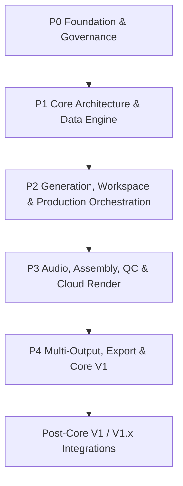

# Work Package Roadmap

> **Canonical Document Location:** [`project-docs/40_DELIVERY/WORK_PACKAGES.md`](project-docs/40_DELIVERY/WORK_PACKAGES.md)

---

## 1. Roadmap Overview

Orbis Video Studio AI is delivered through discrete, bounded Work Packages. Every WP requires explicit Owner authorization before implementation. Completion of one WP never auto-authorizes the next.

The product direction is automation-first: Orbis should orchestrate external Creative, Image, Video and Audio AI services behind adapters while owning the production state, approvals, history, cost control, QC, assembly and export workflow.



---

## 2. Completed Work

- **P0-WP001 — Project Governance & Architecture Documentation Foundation**
  - **Status:** PASS / CLOSED / MERGED

- **P1-WP002 — Backend Core Framework & Domain Database Setup**
  - **Status:** PASS / CLOSED / MERGED

- **P1-WP003 — S3 Object Storage & Asset Management API**
  - **Status:** PASS / CLOSED / MERGED

- **P1-WP004 — Document Ingestion & Text Extraction Engine**
  - **Status:** PASS / CLOSED / MERGED

- **P1-WP005 — Story & Screenplay Script Generator Service**
  - **Status:** PASS / CLOSED / MERGED

- **P2-WP006 — Reference Library & Character/Location Bibles**
  - **Status:** PASS / CLOSED / MERGED

- **P2-WP007 — Vidu Provider Adapter & Durable Job Dispatch Queue**
  - **Status:** PASS / CLOSED / MERGED
  - **PR:** #15
  - **Reviewed Head:** `5a03d4d7f56ac8ae39a78914276610c0512da78b`
  - **Merge Commit:** `9cb098dea7fc2948b023ad48163c729f566573a7`

- **P2-WP008 — Hybrid Shot Engine, Asset Lock Machine & Base Video Mode Configuration**
  - **Status:** PASS / CLOSED / MERGED
  - **PR:** #19
  - **Reviewed Head:** `a2c3f3d4e80a0b0aedb58fba5a04a436c9e88797`
  - **Merge Commit:** `a360c3b38d1d962f9f3c5f6412e3107e90fae7db`

- **P2-WP009 — Cost Control & Granular Usage Audit Ledger**
  - **Status:** PASS / CLOSED / MERGED
  - **PR:** #23
  - **Reviewed Head:** `250df0bb6df24577e2e1f14c7ada3d0dbbaf75fa`
  - **Merge Commit:** `9f094a5cbe9a4faeb5741231d0a819da0da283c1`
  - **Scope delivered:** provider-neutral usage ledger, configurable pricing service, project budget controls, manual adjustment audit, DB-level idempotency/uniqueness and concurrency-safe accounting behavior.

- **P2-WP010 — Mode-Aware Web Workspace & Automation-First Storyboard UX**
  - **Status:** PASS / CLOSED / MERGED
  - **Issue:** #24
  - **PR:** #25
  - **Reviewed Head:** `0f0a16fa95c8110bc8ab7a0c52d45351eaa82182`
  - **Merge Commit:** `639e61fb69b6abee8598074add458035db906ceb`
  - **Final Review:** PASS / READY TO MERGE (Review ID 5124386306)
  - **Scope delivered:** Mode-aware workspace (Story/Short/Loop/Scene), staged workflow with production approval gates, soft-delete / version lineage retention (FULL_HISTORY_RETENTION / NO_SILENT_HISTORY_LOSS), dashboard project management (rename/duplicate/archive/search/sort), actionable queue controls (Generate Selected / Continue incomplete / safe cost confirmation), and provider submission stage fencing.

---

## 3. Active Work Package

- **P2-WP011 — Selective / Batch Regeneration & Resume Service + Performance & Scalability Guardrails**
  - **Status:** **AUTHORIZED / IMPLEMENTED / WAITING CHATGPT REVIEW**
  - **Issue:** #28
  - **Branch:** `ai/p2-wp011-batch-resume`
  - **Current gate:** ChatGPT independent review -> Owner merge decision.

### WP011 Scope Delivered:
- Canonical `BatchResumeService` supporting Generate Selected, Continue Incomplete, Retry Failed.
- Shot-level deduplication (at most ONE new job per shot, even with multiple historical failed jobs).
- Repeat-safe resume semantics (no duplicate active work, preservation of completed assets).
- Lightweight `BatchRun` & `BatchRunItem` audit trail with truthful skip reasons.
- Set-based candidate selection eliminating N+1 database queries.
- Migration `011_batch_resume_runs_and_indexes.py` with targeted indexes.
- Full frontend integration removing client-side retry loops.

---

## 4. Remaining Roadmap — Direction After WP011

The roadmap should prioritize end-to-end production automation rather than building a heavyweight manual NLE.

### Phase 2 — Production Orchestration & Generation

- **P2-WP012 — Production Orchestrator & Staged Approval State Machine**
  - **Status:** PROPOSED / NOT AUTHORIZED
  - Coordinate Story -> Storyboard -> Shot Plan -> Images -> Video with pause/review/continue semantics and AUTO / ASSISTED / MANUAL behavior.

- **P2-WP013 — Provider-Neutral Storyboard Image / Keyframe Pipeline**
  - **Status:** PROPOSED / NOT AUTHORIZED
  - Dedicated ImageProvider abstraction, batch storyboard/keyframe generation, continuity/reference mapping and retry/resume.

### Phase 3 — Audio, Assembly, QC & Cloud Rendering

- **P3-WP014 — Core V1 Audio Production Automation**
  - **Status:** PROPOSED / NOT AUTHORIZED
  - VO, BGM, SFX, ambience, batch audio planning/generation/assignment and basic mixing/ducking.

- **P3-WP015 — Simplified Assembly / Timeline Preview**
  - **Status:** PROPOSED / NOT AUTHORIZED
  - Shot ordering, duration, simple trim, basic audio layers and preview; not a Premiere-class editor.

- **P3-WP016 — QC / Approval Pipeline**
  - **Status:** PROPOSED / NOT AUTHORIZED
  - Continuity checks, missing-asset checks, final review and explicit approval semantics.

- **P3-WP017 — Cloud Render Workers**
  - **Status:** PROPOSED / NOT AUTHORIZED
  - Final assembly/render after approval, preserving deterministic job control and auditability.

### Phase 4 — Multi-Output, Export & Core V1 Release

- **P4-WP018 — Multi-Output & Platform Export Presets**
  - **Status:** PROPOSED / NOT AUTHORIZED
  - 16:9 / 9:16 / 1:1 and platform-specific output variants from one master project.

- **P4-WP019 — Project Export/Import Archive Package (.orbis)**
  - **Status:** PROPOSED / NOT AUTHORIZED

- **P4-WP020 — End-to-End System Integration, UAT & Core V1 Release**
  - **Status:** PROPOSED / NOT AUTHORIZED

### Post-Core V1 / V1.x

- **Full Operational Integration Gateway (Hermes / n8n / external agents)**
  - **Status:** PROPOSED / POST-CORE V1 / V1.x
  - Architecture readiness remains a V1 design requirement; full operational integration must not block Core V1.

---

## 5. Product Locks Governing Future WPs

```text
MULTI_PROJECT = REQUIRED
FULL_HISTORY_RETENTION = REQUIRED
NO_SILENT_HISTORY_LOSS = REQUIRED
AUTOMATION_FIRST = REQUIRED
HUMAN_REVIEW_NOT_HUMAN_MICROMANAGEMENT = REQUIRED
APPROVAL_GATED_AUTOMATION = REQUIRED
GUIDED_FLEXIBILITY = REQUIRED
AUDIO_PRODUCTION = CORE_V1_REQUIRED
PROVIDER_INDEPENDENCE = REQUIRED
LOCAL_AI = DISALLOWED
```

Core V1 modes:

```text
STORY
SHORT
LOOP
SCENE
```

Architecture-ready only until separately authorized:

```text
PRODUCT
EXPLAINER
PRESENTER
MONTAGE
```

Future-mode readiness must not silently expand an active WP.
