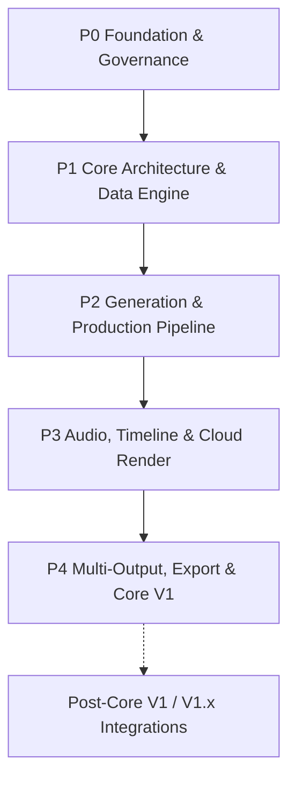

# Work Package Roadmap

> **Canonical Document Location:** [`project-docs/40_DELIVERY/WORK_PACKAGES.md`](project-docs/40_DELIVERY/WORK_PACKAGES.md)

---

## 1. Roadmap Overview

Orbis Video Studio AI is delivered through discrete, bounded Work Packages. Every WP requires explicit Owner authorization before implementation. Completion of one WP never auto-authorizes the next.



---

## 2. Completed Work

- **P0-WP001 — Project Governance & Architecture Documentation Foundation**
  - **Status:** PASS / CLOSED / MERGED

- **P1-WP002 — Backend Core Framework & Domain Database Setup**
  - **Status:** PASS / CLOSED / MERGED

- **P1-WP003 — S3 Object Storage & Asset Management API**
  - **Status:** PASS / CLOSED / MERGED

- **P1-WP004 — Document Ingestion & Text Extraction Engine**
  - **Status:** PASS / CLOSED / MERGED

- **P1-WP005 — Story & Screenplay Script Generator Service**
  - **Status:** PASS / CLOSED / MERGED

- **P2-WP006 — Reference Library & Character/Location Bibles**
  - **Status:** PASS / CLOSED / MERGED

- **P2-WP007 — Vidu Provider Adapter & Durable Job Dispatch Queue**
  - **Status:** PASS / CLOSED / MERGED
  - **PR:** #15
  - **Reviewed Head:** `5a03d4d7f56ac8ae39a78914276610c0512da78b`
  - **Merge Commit:** `9cb098dea7fc2948b023ad48163c729f566573a7`
  - **Scope delivered:** provider-neutral Vidu adapter, durable DB-backed queue/worker, idempotency, claim/lease fencing, bounded retry/poll scheduling, cancellation, ambiguous-submission reconciliation, secret/result safety, migration lifecycle and mocked provider tests.

---

## 3. Next Candidate Work Package

- **P2-WP008 — Hybrid Shot Engine, Asset Lock Machine & Base Video Mode Configuration**
  - **Status:** **PROPOSED / NOT AUTHORIZED**
  - **Proposal:** [`P2_WP008_PROPOSAL.md`](P2_WP008_PROPOSAL.md)
  - **Candidate scope:**
    - hybrid shot sources: AI generated / imported video / imported image / recorded / stock / mixed
    - granular lock state machine
    - base provider-neutral `video_mode` configuration
    - initial V1 modes: STORY / SHORT / LOOP / SCENE
    - Story optional at Project level when mode does not require it
    - preserve WP006 references and WP007 provider/queue boundaries

---

## 4. Remaining Proposed Roadmap

### Phase 2 — AI Generation & Production Pipeline

- **P2-WP009 — Cost Control & Granular Usage Audit Ledger**
  - **Status:** PROPOSED / NOT AUTHORIZED
  - Budget caps, provider usage logging and auditable cost controls.

- **P2-WP010 — Mode-Aware Web Workspace: Storyboard & Shot Grid**
  - **Status:** PROPOSED / NOT AUTHORIZED
  - Browser project creation, Video Mode selection, reference/document upload, mode-aware creative editor and shot grid.

- **P2-WP011 — Selective Shot Regeneration Service**
  - **Status:** PROPOSED / NOT AUTHORIZED
  - Target unlocked shots only, lock validation and provider-neutral regeneration dispatch.

### Phase 3 — Audio, Timeline Editing & Cloud Rendering

- **P3-WP012 — Audio Production & Voice Over / TTS Service**
  - **Status:** PROPOSED / NOT AUTHORIZED

- **P3-WP013 — Subtitle Generator & Auto-Ducking Processor**
  - **Status:** PROPOSED / NOT AUTHORIZED

- **P3-WP014 — Simplified Multi-Track Timeline Preview Engine**
  - **Status:** PROPOSED / NOT AUTHORIZED

- **P3-WP015 — Cloud FFmpeg Video Render Workers**
  - **Status:** PROPOSED / NOT AUTHORIZED

- **P3-WP016 — Human Approval Gates & QC Review Pipeline**
  - **Status:** PROPOSED / NOT AUTHORIZED

### Phase 4 — Multi-Output, Export & Core V1 Release

- **P4-WP018 — Multi-Output & Platform Export Presets**
  - **Status:** PROPOSED / NOT AUTHORIZED
  - 16:9 / 9:16 / 1:1 and platform-specific output variants from one master project.

- **P4-WP019 — Project Export/Import Archive Package (.orbis)**
  - **Status:** PROPOSED / NOT AUTHORIZED

- **P4-WP020 — End-to-End System Integration, UAT & Core V1 Release**
  - **Status:** PROPOSED / NOT AUTHORIZED

### Post-Core V1 / V1.x

- **P4-WP017 — Full Operational Integration Gateway (Hermes / n8n)**
  - **Status:** PROPOSED / POST-CORE V1 / V1.x
  - Architecture readiness remains a V1 requirement; full operational integration must not block Core V1.

---

## 5. Mode Expansion Rule

Core V1 modes:

```text
STORY
SHORT
LOOP
SCENE
```

Architecture-ready only until separately authorized:

```text
PRODUCT
EXPLAINER
PRESENTER
MONTAGE
```

Future-mode readiness must not silently expand an active WP.
