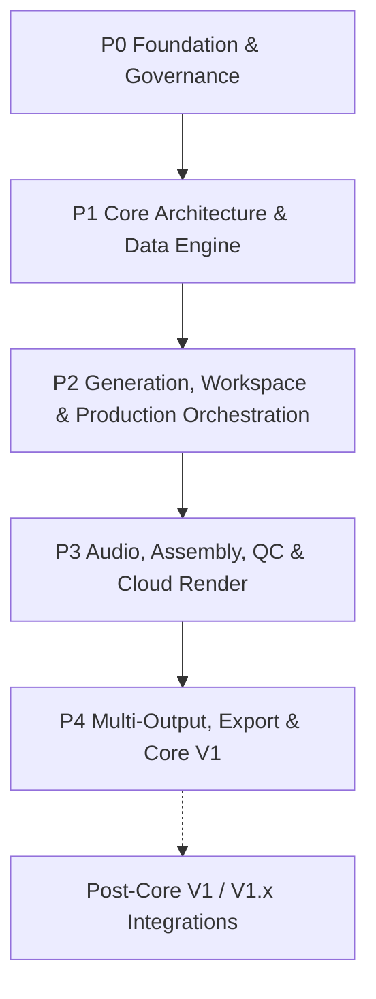

# Work Package Roadmap

> **Canonical Document Location:** [`project-docs/40_DELIVERY/WORK_PACKAGES.md`](project-docs/40_DELIVERY/WORK_PACKAGES.md)

---

## 1. Roadmap Overview

Orbis Video Studio AI is delivered through discrete, bounded Work Packages. Every WP requires explicit Owner authorization before implementation. Completion of one WP never auto-authorizes the next.

The product direction is automation-first: Orbis orchestrates external Creative, Image, Video and Audio AI services behind adapters while owning production state, approvals, history, cost control, QC, assembly, render, export and project portability.



---

## 2. Current Delivery Summary

```text
Completed Core V1 WPs: 19 / 20
WP-count completion: 95%
ACTIVE_WORK_PACKAGE: P4-WP020-LIVE-R3-PRE1
P4-WP020: ACTIVE / NOT CLOSED
Core V1 release: NOT DECLARED
Paid/live R3 execution: NOT AUTHORIZED
```

Current canonical baseline at PRE1 start:

```text
main HEAD: d706acacd1f51224c955fb9c8d0d9eab3deda186
P4-WP020 LIVE R2-C1 PR #74: MERGED / CLOSED
C1 reviewed HEAD: 6c66650312ebbd2433e5b00c7864c086ea37e28e
C1 merge commit: d706acacd1f51224c955fb9c8d0d9eab3deda186
Active PRE1 branch: ai/p4-wp020-live-r3-pre1
```

---

## 3. Completed Work Packages

| WP | Title | Status |
| :--- | :--- | :--- |
| P0-WP001 | Project Governance & Architecture Documentation Foundation | PASS / CLOSED / MERGED |
| P1-WP002 | Backend Core Framework & Domain Database Setup | PASS / CLOSED / MERGED |
| P1-WP003 | S3 Object Storage & Asset Management API | PASS / CLOSED / MERGED |
| P1-WP004 | Document Ingestion & Text Extraction Engine | PASS / CLOSED / MERGED |
| P1-WP005 | Story & Screenplay Script Generator Service | PASS / CLOSED / MERGED |
| P2-WP006 | Reference Library & Character/Location Bibles | PASS / CLOSED / MERGED |
| P2-WP007 | Vidu Provider Adapter & Durable Job Dispatch Queue | PASS / CLOSED / MERGED |
| P2-WP008 | Hybrid Shot Engine, Asset Lock Machine & Base Video Modes | PASS / CLOSED / MERGED |
| P2-WP009 | Cost Control & Granular Usage Audit Ledger | PASS / CLOSED / MERGED |
| P2-WP010 | Mode-Aware Web Workspace & Automation-First Storyboard UX | PASS / CLOSED / MERGED |
| P2-WP011 | Selective / Batch Regeneration & Resume + Performance Guardrails | PASS / CLOSED / MERGED |
| P2-WP012 | Production Orchestrator & Staged Approval State Machine | PASS / CLOSED / MERGED |
| P2-WP013 | Provider-Neutral Storyboard Image / Keyframe Pipeline | PASS / CLOSED / MERGED |
| P3-WP014 | Core V1 Audio Production Automation | PASS / CLOSED / MERGED |
| P3-WP015 | Simplified Assembly / Timeline Preview | PASS / CLOSED / MERGED |
| P3-WP016 | Core V1 QC & Approval Pipeline | PASS / CLOSED / MERGED |
| P3-WP017 | Cloud Render Workers | PASS / CLOSED / MERGED |
| P4-WP018 | Multi-Output & Platform Export Presets | PASS / CLOSED / MERGED |
| P4-WP019 | Project Export/Import Archive Package (`.orbis`) | PASS / CLOSED / MERGED |

---

## 4. P4-WP019 Closure Detail

### P4-WP019 — Project Export/Import Archive Package (`.orbis`)

```text
Status: PASS / CLOSED / MERGED
PR: #50
Branch: ai/p4-wp019-orbis-archive
Final reviewed HEAD: df691035f54c1a9ffea4934b6f43134fde35d391
Merge Commit: a09fcab835515679bf4f0bbfce8aec84f7e15062
Proposal: project-docs/40_DELIVERY/P4_WP019_PROPOSAL.md
```

P4-WP019 must not be reopened unless a proven regression is found.

---

## 5. Remaining Core V1 Roadmap

### P4-WP020 — End-to-End System Integration, UAT & Core V1 Release

```text
Status: ACTIVE / NOT CLOSED
Current sub-gate: P4-WP020-LIVE-R3-PRE1
Current authorization: NO-PAID PRE1 ONLY
Core V1 release declaration: NOT AUTHORIZED
```

Purpose remains:

- verify the already-delivered Core V1 system end to end;
- execute bounded UAT across the supported Core V1 modes and critical production path;
- verify failure/recovery, cost, history, approval, render/export and archive behavior at system level;
- close release-blocking defects only within authorized WP020 contracts;
- collect release evidence and make the final Core V1 release decision.

### LIVE history

R1:
- consumed / immutable;
- bounded OpenAI call returned HTTP 429;
- STOP enforced.

R2:
- execution ID `LIVE-20260909-BB75-R2`;
- run `34287696335`;
- execution fence consumed;
- OpenAI STORY succeeded;
- Gemini IMAGE returned non-success HTTP surfaced as `HTTP_ERROR`;
- exact historical Gemini HTTP status was not durably retained;
- conservative chargeable requests consumed = 2/6;
- last known confirmed/committed UAT cost at STOP = USD 0.0072;
- Vidu / ElevenLabs / downstream live proof not executed;
- R2 must never be rerun.

R2-C1:
- Gemini HTTP Evidence + Control-Truth Corrective;
- PR #74 merged;
- future Gemini non-2xx evidence now preserves sanitized HTTP status/classification;
- C1 provider calls = 0;
- C1 spend = USD 0.00.

### Active R3-PRE1

`P4-WP020-LIVE-R3-PRE1 — Gemini Access Probe + Resume Contract + Control-Truth Sync`

Authorized as NO-PAID only:

- prepare manual-only Gemini `models.get` metadata probe;
- after merge, exactly one authenticated GET to `models/gemini-3.1-flash-image`;
- no generation request, no prompt/image payload, no paid dispatch;
- sanitize evidence to model/status/http/error classification;
- tests for success/failure classification and secret/body non-leakage;
- synchronize control truth;
- draft R3 resume contract.

Detailed contract: `P4_WP020_LIVE_R3_PRE1.md`.

### Proposed R3 — Not Authorized

R2 used ephemeral PostgreSQL/MinIO and its retained artifact is historical evidence, not reusable canonical project state. The proposed future R3 therefore creates a new isolated UAT project and executes one coherent full provider chain:

```text
OpenAI STORY x1
Gemini IMAGE x1
Vidu VIDEO x1
ElevenLabs AUDIO x3
Maximum chargeable requests: 6
Hard cap: USD 1.00
Sequential only
OpenAI retries: 0
```

R3 execution identity and exact authorized main SHA are intentionally unassigned until later tooling is merged and fresh Owner paid/live authorization is recorded.

Draft contract: `P4_WP020_LIVE_R3_RESUME_CONTRACT.md`.

---

## 6. Post-Core V1 / V1.x — Not Part of WP020 by Default

The following remain future work unless separately authorized:

- full Hermes / n8n / external-agent operational gateway;
- new production modes beyond STORY / SHORT / LOOP / SCENE;
- new provider implementations beyond currently accepted Core V1 boundaries;
- cloud-hosted ComfyUI provider implementation;
- social publishing automation;
- marketplace/provider ecosystem;
- heavyweight NLE/DAW capabilities;
- realtime cloud project replication/sync.

ComfyUI + Cloud GPU remains a future provider/execution candidate only and is not authorized by WP020.

---

## 7. Product Locks Governing Future WPs

```text
MULTI_PROJECT = REQUIRED
FULL_HISTORY_RETENTION = REQUIRED
AUDITABLE_CHANGES = REQUIRED
NO_SILENT_HISTORY_LOSS = REQUIRED
AUTOMATION_FIRST = REQUIRED
HUMAN_REVIEW_NOT_HUMAN_MICROMANAGEMENT = REQUIRED
APPROVAL_GATED_AUTOMATION = REQUIRED
GUIDED_FLEXIBILITY = REQUIRED
AUDIO_PRODUCTION_CORE_V1 = REQUIRED
PROVIDER_INDEPENDENCE = REQUIRED
PERFORMANCE_AND_SCALABILITY = REQUIRED_PRODUCT_QUALITY_ATTRIBUTE
LOCAL_AI = DISALLOWED
CLOUD_AI = REQUIRED
VENDOR_LOCK_IN = DISALLOWED
```

Core V1 modes: `STORY / SHORT / LOOP / SCENE`.
Future architecture-only modes: `PRODUCT / EXPLAINER / PRESENTER / MONTAGE`.

---

## 8. Execution Rule

```text
ACTIVE_WORK_PACKAGE = P4-WP020-LIVE-R3-PRE1
```

Only the explicitly authorized NO-PAID PRE1 scope may proceed. PRE1 does not authorize R3 paid execution, release mutation, production deployment, or Core V1 release declaration.
